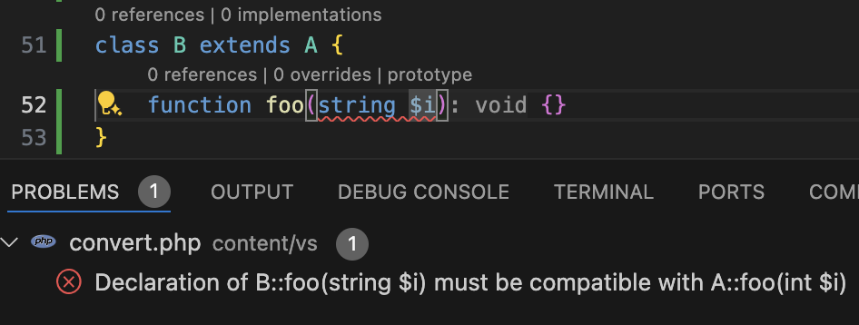
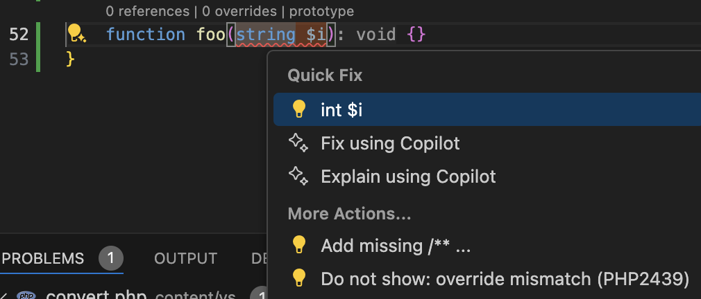
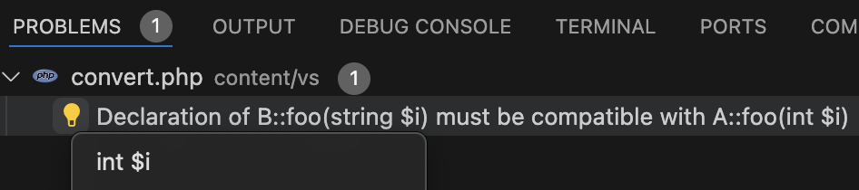

/*
Title: Problems Quick Fix
*/
# Problems Quick Fix

Some errors, warnings, and messages (listed in _Problems_ window and underlined in the editor) have a quick fix available. 

## Fix in the Editor Window

Navigate to the line with problem and choose one of the following:

- Click light bulb and choose the fix.
- Use the Quick Fix shortcut (`Ctrl+.` or `Cmd+.`).
- Mouse-hover over the problem, click "Quick Fix", and choose the fix.

## Fix in the Problems Window

You can fix all the problems right in the Problems window. Click the light bulb next the the problem and choose the fix:

