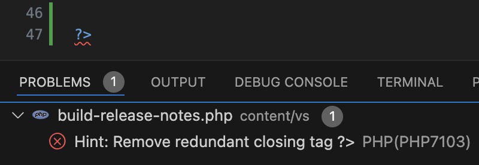

# Code Action Severity

By default, code actions are treated as editor **hints** - they are not listed in _Problems_ window and they are not underlined in the editor.

This can be changed so specific code action can be underlined as an error, a warning, or a message, and listed in _Problems_ window.

## Using `.editorconfig` File

Open or create file named `.editorconfig`, typically in the workspace root folder. Set the code action convention to one of the following:

- `error`: code action will be underlined as an error (red squiggly line) and listed in _Problems_ window. 
- `warning`: code action will be underlined as a warning (yellow squiggly line) and listed in _Problems_ window.
- `message`: code action will be underlined as a message (blue squiggly line) and listed in _Problems_ window.
- `autofix`: code action will be underlined as a message (blue squiggly line), listed in _Problems_ window, and automatically applied as **autoFix** (can be enabled using setting `"editor.codeActionsOnSave": {"source.fixAll": "explicit"}`).
- `force`: code action will be underlined as an error (red squiggly line), listed in _Problems_ window, and automatically applied as **autoFix** (can be enabled using setting `"editor.codeActionsOnSave": {"source.fixAll": "explicit"}`).
- `false`: code action will be hidden.

_Example:_

```ini
[*.php]
php_remove_redundant_closing_tag=error
```

