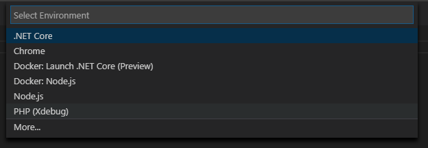

/*
Title: Debug Overview
Description: 
*/

# Debug Overview

PHP Tools for VS Code extends VS Code with PHP debugging capabilities which allows debugging on your local development server and also on a remote server. The debugging engine takes advantage of [Xdebug](https://xdebug.org/) PHP extension.

For general information about debugging in Visual Studio Code, such as inspecting variables, setting breakpoints, and other activities that aren't language-dependent, review [VS Code debugging](https://code.visualstudio.com/docs/editor/debugging).

## Requirements:

- PHP 5.6 or newer with compatible Xdebug extension

### Checklist:

-	Xdebug must be configured within your PHP installation in order to make the debugging function working. 
  -	If you have Windows, see Configuring Xdebug. 
  -	For Mac you can take a look here https://blog.devsense.com/2019/how-to-install-xdebug-for-phptools-for-vscode-on-mac . 
  -	For Linux consult manual specific for your linux distribution
- Xdebug extension must operate on the TCP port specified in the [Launch Profiles]( vscode/debug/launch-json). And your firewall must be properly set up to allow communication through this port.
-	Ensure Xdebug is properly configured: run `php -–version` and check the last line of the output is `with Xdebug`.
-	Ensure php.ini states the following directives:

```
xdebug.remote_enable = 1
xdebug.remote_autostart = 1 // or append `XDEBUG_SESSION_START=1` parameter to the URL of page you want to debug
```

## Initial setup

-	First select Debug View in the sidebar: 
 
 
-	If you don’t have any configuration defined you will see “No Configuration” in the drop-down list. Click on the configuration icon with the red dot (the dot is not present if you have some configuration)

  

  A configuration menu will appear from the Command Palette, choose PHP (Xdebug).
 
 
  This command will generate `launch.json` file in the `.vscode` folder with pre-defined configurations and opens the file in editor. The details of configuration properties are explained in section [Launch Profiles]( vscode/debug/launch-json)

## Features

The debugging features are the following:

- Stepping by line, step in, step out.
- Placing breakpoints, conditional breakpoints, break on hit count.
- Logging breakpoint hit into 'Debug console'.
- Breaking on exceptions, warnings, and errors.
- Specifying non-user files (exceptions won't break debugging, stepping through).
- Watch tool tips.
- Listing locals and superglobals.
- Editing variable or property value, handling long string values efficiently.
- Long arrays watch efficiently.
- Debug watch expands objects and arrays.
- Evaluating code in 'Debug console'.
- Debug launch profiles.
- Built-in web development server.
- Debugging of 'PHP Unit' test cases.

## Troubleshooting

## Related links

- [Xdebug.org](https://xdebug.org/)
