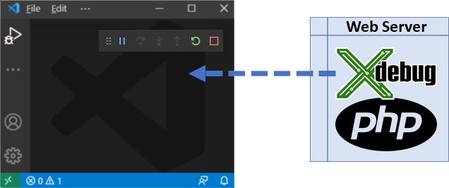
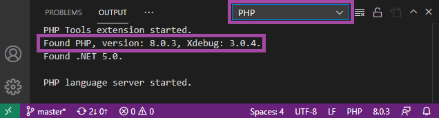

/*
Title: Debug Overview
Description: 
*/

# Debug Overview



Debugging of PHP code in VS Code allows for inspecting a PHP program, inspecting actual variables, stack traces, exceptions, breaking and stepping through the code, debugging PHPUnit tests, and more.

## Requirements

In order to debug a PHP program, you need PHP (either installed locally or on your server) together with [Xdebug](https://xdebug.org) extension.

- PHP >= 5.6
- Xdebug extension. Follow the steps on [Xdebug.org Install](https://xdebug.org/docs/install).

### Local PHP Installation

In case there is more PHP installations on the system, see [choosing PHP Version](../php-version) and select the right one.

To verify your PHP and Xdebug are installed correctly:

- Open a `.php` file in VS Code
- Open the `OUTPUT` view, tab `PHP`.



If PHP with Xdebug is installed correctly, you will see

```
Found PHP, version x.y.z, Xdebug: x.y.z.
```

### `php.ini` Configuration

Xdebug needs to be set in `php.ini` file that corresponds to your PHP installation.

- **On Windows** it is located next to your `php.exe`.
- On **Linux/Mac**, there is usually a separate `xdebug.ini` file (usually something like `/etc/php/8.0/cli/xdebug.ini`).

Edit the `.ini` file, and ensure there are the following directives (Note, it is different for Xdebug version `2` and version `3`):

```ini
; Xdebug 3
zend_extension = "<path to the xdebug library>" ; "...\xdebug.dll" or ".../xdebug.so"
xdebug.mode = debug
xdebug.client_host = 127.0.0.1
xdebug.client_port = 9003
xdebug.start_with_request = trigger
```

```ini
; Xdebug 2
zend_extension = "<path to the xdebug library>" ; "...\xdebug.dll" or ".../xdebug.so"
xdebug.remote_enable = 1
xdebug.remote_handler = dbgp
xdebug.remote_host = 127.0.0.1
xdebug.remote_port = 9000
xdebug.remote_mode = req
```

### Server PHP Installation

> This applies to the situation, when PHP is not running on your local system but it's on a **Cloud**, **Web Host**, **Docker**, **Xampp**, etc.

In case `php` itself is not running on your local system, consult the installation of PHP+Xdebug with the specific server host.

You can then take advantage of [DBGP Proxy](debug-dbgp-proxy) to allow multiple users to debug the same site safely.

## Features

The debugging features are the following:

- Stepping by line, step in, step out.
- Placing breakpoints, conditional breakpoints, break on hit count.
- Logging breakpoint hit into 'Debug console'.
- Breaking on exceptions, warnings, and errors.
- Specifying non-user files (exceptions won't break debugging, stepping through).
- Watch tool tips.
- Listing locals and superglobals.
- Editing variable or property value, handling long string values efficiently.
- Long arrays watch efficiently.
- Debug watch expands objects and arrays.
- Evaluating code in 'Debug console'.
- Debug launch profiles.
- Built-in web development server.
- Debugging of 'PHP Unit' test cases.

## Troubleshooting

These are steps that should help to diagnose and solve common problems with debugging PHP:

- Runnig the following command should display **no warnings**, and an **Xdebug notice**:
  ```
  php --version
  ```
  ```
  PHP 8.0.3 (cli) Copyright (c) The PHP Group
  Zend Engine v4.0.3, Copyright (c) Zend Technologies
      with Xdebug v3.0.4, Copyright (c) 2002-2021, by Derick Rethans
  ```

- The port number specified in Xdebug `.ini` configuration should be `9000` or `9003`, or it should match the `"port"` specified in the [Launch Profiles](vscode/debug/launch-json).
- Firewall must be properly set up to allow communication through the Xdebug port.
- Append the following query parameter when opening the debugged PHP Web Site:
  ```
  ?XDEBUG_SESSION_START=1
  ```
  For example: `http://localhost/?XDEBUG_SESSION_START=1`

## See Also

- [Xdebug.org](https://xdebug.org/)
- [Installing Xdebug on Mac](https://blog.devsense.com/2019/how-to-install-xdebug-for-phptools-for-vscode-on-mac)
- [Launch Configurations](launch-json)