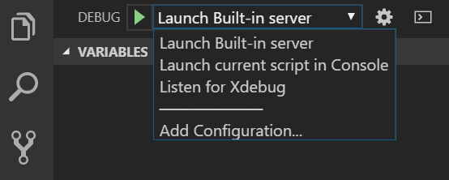

/*
Title: Launch Profiles
Description: Configuration of the debugger.
*/

# Launch Profiles

Launch profiles define the way Visual Studio Code Debugger executes the project. The profiles can pass parameters to the debugger to modify its function.

## launch.json

Visual Studio Code stores debugging configuration in a `launch.json` file located in a .vscode folder in a workspace (project root folder) or in user or workspace settings. The file can contain multiple profiles that can be selected before starting the debugger in the Debug pane in VS Code.



## Web Application

The following profile starts the PHP built-in web server. The server is started only if the `runtimeArgs` contains the parameter `-S` that defines the location and port of the server.

```json
{
    "name": "Launch Built-in server",
    "type": "php",
    "request": "launch",
    "runtimeArgs": [
        "-S",
        "localhost:8888",
        "-t",
        "\\\\remotepc\\Shared\\Test"
    ],
    "pathMappings": {
        "\\\\remotepc\\Shared\\Test\\": "${workspaceRoot}\\src",
        "\\\\test": "C:\\Users\\usr\\Documents\\VSCode\\src\\"
    },
    "port": 9000
}
```

## Console Application

The following profile instructs PHP Tools to start the PHP interactive shell with the current file as parameter. The shell is actually opened only if the `externalConsole` parameter is set to `true`; otherwise, the script is executed with the console is hidden.

```json
{
    "name": "Launch current script in Console",
    "type": "php",
    "request": "launch",
    "program": "${file}",
    "cwd": "${fileDirname}",
    "externalConsole": true,
    "port": 9000
}
```

## Remote Application (Attach)

The following basic profile informs the debugger that it should try to connect to an already running Xdebug server. PHP Tools won't start any server, because there is no `program` or `runtimeArgs` parameter, like in the previous profiles.

```json
{
    "name": "Listen for Xdebug",
    "type": "php",
    "request": "launch",
    "port": 9000
}
```

## Debug Current Script

Whenever there is no `launch.json` present, PHP Tools' debugger launches the current script in the interactive shell mode with the console hidden.
