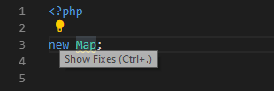
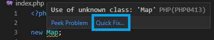
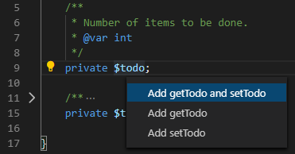
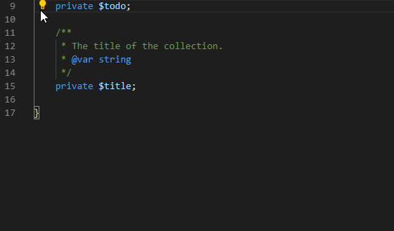
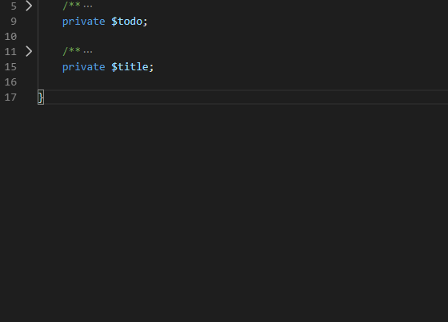
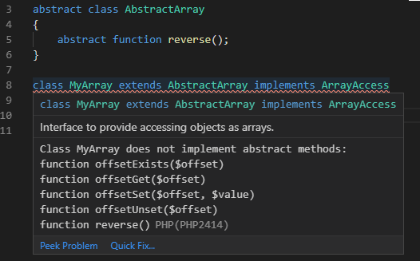
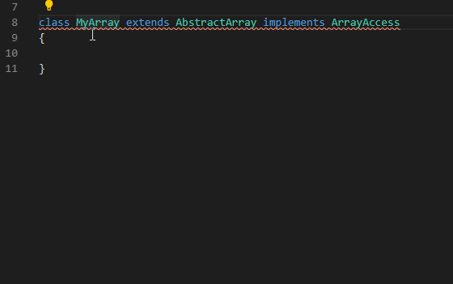
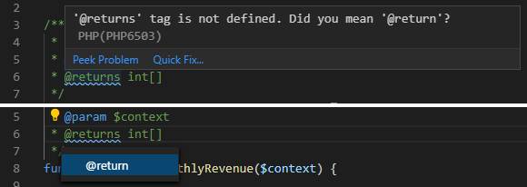
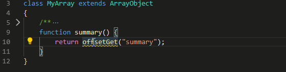

/*
Title: Code Actions
Description: Using PHP code actions
*/

## Code Actions

The editor is provided with so-called **Code Actions** - Quick Fixes and refactorings for the text currently under the caret. The available code action is annotated with a light bulb next to the text.

Available code actions are listed by clicking on the light bulb or pressing an associated keyboard shortcut (by default) <kbd>Ctrl+.</kbd>.

Certain errors have also `Quick Fix` available. This provides the same list of code actions that should resolve the issue.

### Getters and Setters

Generating getters and/or setters for private and protected properties can be done using the following code action. This will add the function `get` and `set` for the selected property at the end of the current class.

The inserted code contains all the available type annotations. In case the current version of PHP is `7` or higher, also the return type is added. For PHP `7.4` and higher, the property's type hint is taken into account as well.

The code action supports adding getter only, setter only, or both. In case more properties are selected, the code action allows to generate getters/setters for all of them at once.

### Missing abstract functions

Error `PHP2414` indicates that the non-abstract class has some functions missing. The quick fix or code action automatically implements the missing abstract functions, including all the available documentation and type information. The generated code is inserted at the end of the class.

The code action resolves the complete class hierarchy, taking into account interfaces and classes. Generated code contains PHPDoc annotations and base implementation of methods if applicable.

### Import Name

Error `PHP0413` indicates that the type does not exist in the current namespace context. If possible, a code action with all available fixes is provided.

The code action allows you to add `use` declaration or fully qualify the name in place. Code actions include all the possible names that are found within the current workspace.

### Unused `use` fix

Any `use`, group of `use`, or a single alias that is not needed in the code is immediately dimmed.

Code action `Remove unnecessary 'use'` quickly cleanups the block of uses.

### Fix typo in PHPDoc keyword

Error `PHP6503` suggests that there is a typo in the PHPDoc keyword and offers a quick fix.

### Add missing `$this->`

If applicable, a code action suggesting to add `$this->` is provided. This fixes a common issue when an instance function is called without specifying the `$this` object.

## See also

- [Refactoring](refactoring)
- [PHPDoc Completion](phpdoc)
