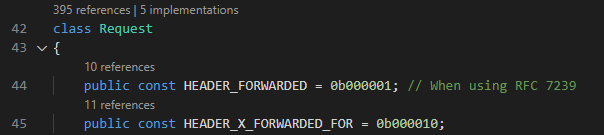
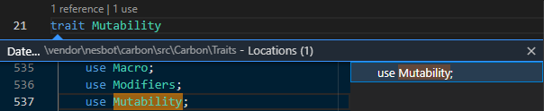
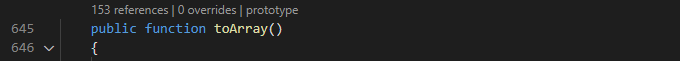

/*
Title: Code Lens
Description: Using PHP code lenses
*/

## Code Lens

CodeLens appears above functions, classes, interfaces, traits, properties, and constants. This margin provides quick contextual information about your code - references, implementations, overrides, or the method prototype. Upon clicking on the text, the detailed window is opened.

This feature can be disabled/enabled in user-scope setting `php.codeLens.enabled`.

### References &amp; Implementations

Every PHP declaration is decorated with `references` code lens. *References* provides the same list as the contextual command `Find all references`. 

Additionally, interfaces and classes are decorated with `implementations` code lens providing a list of all the types that extend or implement this type.

### Trait Uses

In the case of `trait` declaration, the *trait* heading is decorated with `uses` code lens. This allows to quickly list all the places within the workspace where the *trait* is used as a part of a class or another trait.

### Method Overrides &amp; Prototype

Non-private methods are decorated with `overrides` code lens providing a list of methods that override this implementation.

Additionally, there is `prototype` code lens quickly navigating you to the base implementation of the method, if there is any.

## See also

- [Configuration](../configuration)
- [Code Actions](code-actions)
- [Refactoring](refactoring)
- [Testing](../test-explorer)
