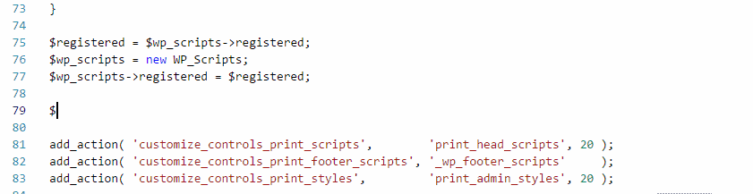

/*
Title: Code Completion
Description: PHP code completion.
*/

# Code Completion

The PHP editor analyses the entire workspace, it determines expressions type, function return type, property type, and local variables type. The inferred type information can be improved by providing further details using PHPDoc comments (see below).



Code completion is context-aware, scope-aware, type-aware, with the respect to conventions and additional heuristics.

## Automatic Triggers

The completion can be triggered manually (`Ctrl+Space` by default) or automatically. The automatic triggers are:

- a letter completes available symbols in the current context
- `::` after a class/interface/trait name completes the type static members and constants.
- `->` after an object instance completes the object's non-static members.
- `\` as a part of a qualified name completes the namespaced (qualified) type name.
- `$` as a first letter shows variables in the current function scope.
- a letter or `Ctrl+Space` after `new` keyword completes possible class names
- a letter or `Ctrl+Space` after `throw new` completes only throwable classes
- a letter or `Ctrl+Space` after `use` keyword.
- `/**` above a declaration completes a PHPDoc comment block (needs `editor.formatOnType` setting to be enabled). See [PHPDoc Generator](phpdoc) for more details.

## Additional Information

The editor provides an option to show additional information about the symbol in the code completion list. The information contains the symbol's description as it is written in the corresponding PHPDoc or PHP manual. Additional information may include:

- URL to the corresponding PHP manual Web Site.
- a return value description.
- a Laravel facade accessor.
- a compatibility status, such as a deprecation.

## Optimizing Completion

In case variable's or function's type information cannot be inherited, it is advised to provide the expected type in form of a PHPDoc comment. The type hinting works for functions, properties and variables.

An example of type hinting:

```php
class SomeClass
{
    /**
     * @var array|null
     */
    var $property;

    /**
     * @return SomeClass
     */
    function foo()
    {
        $x = eval('magic1()');
        /** @var $x PDOStatement */
        $x->query();

        return eval('magic2()');
    }
}
```

## Limitations

The code editor may not resolve `class_alias()` without constant expressions; therefore some aliased class names may not be included in the code completion.

The code editor won't recognize files containing a syntax error.

The code editor may not provide precise completions after `eval()` expression or after classes being instantiated indirectly (using an expression `new $classname` instead of a constant qualified name).
