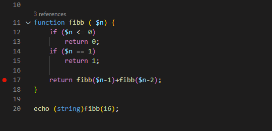

/*
Title: Code Formatting
Description: Source code formatting
*/

# Code Formatting

The editor provides the document formatting feature for PHP documents. Right click the editor area and choose `Format Document`.



>> In order to format the document, it must be syntax-error free.

The code formatting normalizes whitespaces, line endings, opening and closing braces, indentation and pretty print spaces.

# Configuration

The formatting behavior is set in `settings.json`. All the relevant settings and their effects are summed up in the following table.

Setting | Effect
--- | ---
`editor.insertSpaces` | Spaces are used to indent code if `true`, tabs are used otherwise.
`editor.tabSize` | Number of spaces that represent a single tab, this value is used only when `editor.insertSpaces` is `true`
`php.format.codeStyle` | Preferred code style described in previous sections, available values are `PHP Tools` and `PSR-2`

# Code Styles

Document formatting is available in two versions that differ in the way they structure the document: [PHP Tools](##PHP\ Tools), [PSR-2](##PSR-2). The styles are selected in [settings](#Configuration). The styles share most features, summed up in the following table, while they differ in a couple of details, explained in their own sections.

Feature | Behavior
--- | ---
Pretty print | Spaces are inserted after keywords, names and separators to make the code more readable.
Indentation | Code is indented based on the number of embedded blocks.
Multi-line comments | Subsequent lines are offset to match the first asterisk character on the first line
Statements | Every statement starts on a new line.
Anonymous functions | The body is indented from the beginning of the line where the `function` keyword is defined.
Use construct | The use construct in anonymous functions is always on the same line as the `function` keyword.
Control flow | Close keywords of control flow constructs (`endif`, `endfor`, ...) always start on a new line.
Namespace | An empty line is inserted after a namespace declaration.
Use statement | Use declarations are not separated by empty lines, but an empty line is inserted after all the declarations.

```php
// Pretty print
if ($volume != 0) {
    $density = $mass / $volume;
}
```

```php
// Indentation
function foo ()
{
    if ($x) {
        if ($y) {
            echo $x + $y;
        }
    }
}
```

```php
// Multi-line comments
/* 
 * Following lines are offset
 * by the first asterisk
 */
```

```php
// Statements
echo "hello"; // the secod echo must be on a new line
echo "world";
```

```php
// Anonymous functions
if ($x) {
    $example = function ()
    {
        var_dump($x);
    };
}
```

```php
// Use construct
$example = function () use ($x) 
{
    var_dump($x);
};
```

```php
// Control flow
if ($a == 5):
    echo "a equals 5";
else:
    echo "a is not 5";
endif;
```

```php
// Namespace and Use statements
namespace foo;

use My\Full\Classname as Another;
use My\Full\NSname;
use ArrayObject;

echo "hello world";
```

## Code Style: PHP Tools

The default code style is compliant with the formatting in PHP Tools for Visual Studio. This style focuses on leaving the code visual structure as untouched as possible, while normalizing the whitespaces where possible.

Feature | Behavior
--- | ---
Multi-line expressions |  Subsequent lines maintain their indentation from the first line.
PHP blocks indentation |  Contents of PHP blocks is indented from the open tag (`<?php` or `<?=`).
Code blocks |  Code blocks always start on a new line for both declarations and code.

```php
// Multi-line expressions
$x = $a +
     $b +
     $c;
```

```php
// PHP blocks indentation
<?php 
echo $x;
?>
      <?php
      if ($x == 0)
          $x++;
      ?>
```

```php
// Code blocks
function foo()
{
    if ($x)
    {
        echo $x;
    }
}
```

## Code Style: PSR-2

This formatting style is compliant with [PSR-1](https://www.php-fig.org/psr/psr-1/) and [PSR-2](https://www.php-fig.org/psr/psr-2/) standards .

Feature | Behavior
--- | ---
Multi-line expressions | Subsequent lines are indented one level deeper than the initial line
PHP blocks indentation | Content of PHP blocks is indented from the beginning of the line, the open tag is not moved
Code blocks | Body of a declarations starts on a new line, while control flow block starts on the same line as the construct

```php
// Multi-line expressions
$x = $a +
    $b +
    $c;
```

```php
// PHP blocks indentation
<?php 
echo $x;
?>
      <?php
if ($x == 0)
    $x++;
?>
```

```php
// Code blocks
function foo()
{
    if ($x) {
        echo $x;
    }
}
```

# HTML, JS and CSS Formatting

PHP Tools support HTML, JS and CSS formatting in PHP files. The HTML fomatting process is provided by Visual Studio Code and PHP Tools integrates the functionality with PHP formatting.
