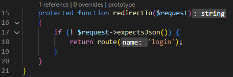
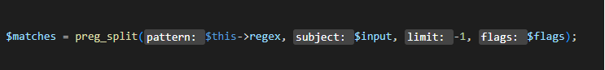
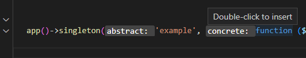
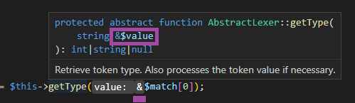

/*
Title: Inlay Hints
Description: 
*/

# Inlay Hints

> available since `1.31` (or `1.30` pre-release)

Inlay Hints are additional intra-text-information appearing in code. They add contextual and type data, which makes the code easier to read and navigate.



## Parameters Name

The parameter name is prepended to all function arguments. The syntax matches the PHP-named-parameters syntax.



Double-click on the inlay hint to insert the named parameter into the code.



**Settings:**

- `"php.inlayHints.parameters.enabled": true`: enable or disable the inlay hint for parameter names.
- `"php.inlayHints.parameters.suppressNameMatchingValue": false`: hide parameter name if it is the same as the value.

## Parameters By-Ref

Arguments passed by reference are annotated with `&` sign.



**Setting:** `"php.inlayHints.parameters.byReference": true`

## Return Type

Return types are annotated in case they are not specified. The type is inferred from the code type analysis; and shortened using the current namespace context.

Double-click on the inlay hint to insert the return type into the code.


**Setting:** `"php.inlayHints.types.return": true`

## Variable Assignment Type

Variable assignments are annotated with the resulting type.

**Setting:** `"php.inlayHints.types.variable": true`

## Customization

In addition to the **settings** above, there are global settings:

- `"editor.inlayHints.enabled"`
- `"editor.inlayHints.padding"`
- `"editor.inlayHints.fontFamily"`
- `"editor.inlayHints.fontSize"`

To customize the inlay hints colors, alter the theme colors using `"workbench.colorCustomizations": {}` setting.

**Example:**

```json
"workbench.colorCustomizations": {
    "editorInlayHint.background": "#f00",
    "editorInlayHint.foreground": "#fff"
},
```

**All inlay colors:**

- `editorInlayHint.background`: Background color of inline hints.
- `editorInlayHint.foreground`: Foreground color of inline hints.
- `editorInlayHint.typeForeground`: Foreground color of inline hints for types
- `editorInlayHint.typeBackground`: Background color of inline hints for types
- `editorInlayHint.parameterForeground`: Foreground color of inline hints for parameters
- `editorInlayHint.parameterBackground`: Background color of inline hints for parameters

## See also

- [Code Lens](code-lens)
- Visual Studio Code Theme Colors: https://code.visualstudio.com/api/references/theme-color
- Customizing Theme Colors: https://code.visualstudio.com/docs/getstarted/themes#_customizing-a-color-theme
