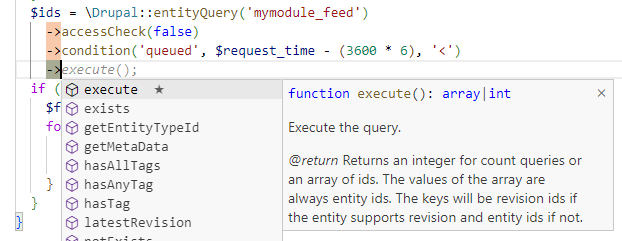

/*
Title: IntelliPHP
Description: AI Autocomplete for PHP
*/

# IntelliPHP - AI Autocomplete for PHP

IntelliPHP is an advanced AI-assisted development tool specifically tailored for PHP programmers. Just like its counterpart **IntelliCode**, IntelliPHP harnesses the power of machine learning to understand PHP code and provide context-aware suggestions. Unlike GitHub Copilot, IntelliPHP operates entirely locally, ensuring that code remains secure and private within their own development environments.

The primary aim of IntelliPHP is to save developers time spent in typing code. It's designed to offer suggestions ranging from short and highly likely suggestions up to whole lines of code. The model has been trained in-house on vast repositories of PHP code, making it adept at providing accurate and relevant suggestions tailored to PHP development.

## Installation and Setup

IntelliPHP seamlessly integrates with Visual Studio Code, enhancing your PHP development experience. To get started, follow these simple steps:

1. **Prerequisites:** Ensure you have Visual Studio Code installed on your system. While the [PHP extension](https://marketplace.visualstudio.com/items?itemName=DEVSENSE.phptools-vscode) for VS Code is not mandatory for IntelliPHP to function in VS Code, it is highly recommended. The PHP extension and IntelliPHP communicate to enhance your user experience and productivity, ensuring you get the most out of this powerful tool.

2. **Download and Install IntelliPHP:** To add IntelliPHP to your Visual Studio Code environment, search for `IntelliPHP` in the VS Code extension pane and click the **Install** button. You can also click here to [Install IntelliPHP](vscode:extension/DEVSENSE.intelli-php-vscode).

3. **Configuration:** After the installation, no further configuration is required.

## Features

IntelliPHP is designed to save you time and boost your productivity. Here are some of its key features:

- **AI Auto-completion:** Enjoy context-aware auto-completion suggestions as you type your PHP code.
- **Code Snippets:** IntelliPHP provides code snippets and whole lines of code to streamline your development process.
- **Framework Support:** Whether you're using Laravel, Symfony, or any other PHP frameworks, IntelliPHP has you covered.
- **Local:** IntelliPHP operates locally, no code leaves your machine EVER.
- **Speed:** IntelliPHP was designed to run efficiently on CPU, no GPU is required! The suggestions are returned without any latency penalty caused by the network.

## Accepting suggestions

When IntelliPHP offers a suggestion, you can effortlessly incorporate it into your code:

**Accepting Suggestions:** Simply press <kbd>TAB</kbd> to accept a suggestion. If you've already partially typed a suggestion, the first <kbd>TAB</kbd> will complete the first part, and a second <kbd>TAB</kbd> will finish the rest.

You can also accept just a current word in the offered suggestion by pressing <kbd>Ctrl</kbd> + <kbd>Right Arrow</kbd>.

**Snippets:** IntelliPHP intelligently identifies parts of the suggestion that require developer input and places the cursor there. You can then easily fill in the necessary details. Pressing <kbd>TAB</kbd> will navigate to the next input location within the suggestion, helping you efficiently complete the snippet. If there are no more input locations, pressing <kbd>TAB</kbd> will take you to the end of the suggestion, allowing you to continue your coding seamlessly.

**Continuous Typing:** If a suggestion isn't what you need, continue typing, and the suggestion will disappear. A new one might appear if it's a better fit for your code.

## Pre-selecting the item in the completion list

When you are using IntelliPHP with [PHP extension](https://marketplace.visualstudio.com/items?itemName=DEVSENSE.phptools-vscode) you will get intelligent pre-selection of the most probable item in the completion list.

## Troubleshooting

Encountering issues? Please let us know at [community.devsense.com](https://community.devsense.com)
