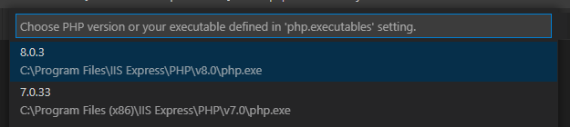

/*
Title: Selecting PHP
Description: Selecting and defining PHP version to be used by the editor
*/

## PHP Version

A workspace uses the selected version of PHP to analyze the code, to provide specific code completions, to initiate built-in web server, and to run tests.

Each workspace may use a different version PHP, depending on the `"php.version"` setting.

## Status Bar

When editing a PHP code, the selected version of PHP is shown in the right part of the VS Code status bar, next to "PHP" language mode.


Click on the version or run command `> Select PHP version` to open a quick picker with available PHP versions or defined profiles:



Selected version will be stored in the workspace `"php.version"` setting.

## `php.version`

The setting `php.version` specifies which PHP will be used within the current workspace. It can be either a full version string (e.g. "7.4.33), an identifier defined in `php.executables` below (e.g. "latest"), or a version prefix (e.g. "8" or "7.4").

**Example:**

```json
{
    "php.version": "8.0"
}
```

This setting is automatically modified by the version picker initiated from the status bar above.

## `php.executables`

`php.executables` setting allows to define custom paths to PHP binaries. Defined binaries will be also listed in the version picker.

Each executable has a unique name, which will be used to identify the PHP binary in `"php.version"` setting and the version picker.

**Example:**

```json
{
    "php.executables": {
        "8.1-dev": "/opt/private/php",
        "latest": "/usr/bin/php"
    }
}
```

**Usage:**

The `php.version` setting is defined within a **workspace**, and thus can be shared on a source control between more machines and users. Specified version identifier (e.g. "7.4", "latest", or "8.1-dev") is defined by `php.executables` setting which is **user-specific**, and not shared between users. Each user defines their own executable paths for the same `php.version`.
