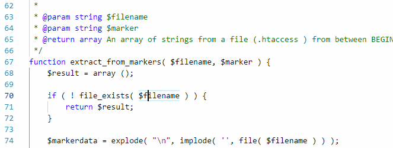

/*
Title: Refactoring
Description: 
*/

# Refactoring

The refactoring is a set of features that allow for semantic-based code modifications across multiple files. The changes are only applied when PHP Tools has all the necessary information to assure that the changes won’t corrupt the code.

Refactoring works best for well-documented code, with annotated types and type hints for function parameters and return type.

> The refactoring is disabled (aborted) when there is a syntax error in the project. This is done in order to avoid corrupting the code.

## Rename Symbol

Name of local variables, constants and functions can be renamed.

Right-click the name and choose `Rename Symbol`, or select a name and press the `F2` key. Alter the name and confirm. If more than the current document is affected by the change, all documents are opened in the Visual Studio Code window so the changes can be reviewed or reverted. Changes are not saved to disk.

## See also

- [Code Actions](code-actions.md)
- [PHPDoc Completion](phpdoc.md)
