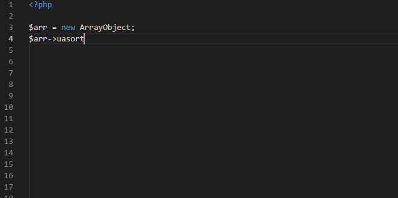

/*
Title: Signature Helper
Description: 
*/

# Signature Helper

The signature help window assists with filling in function parameters. It popups when user enters an opening parenthesis `(` or a comma `,` within a known function call.

The help window shows function's header, its parameters and default values.

## Methods overloads

In case there are more possible function overloads (since some of non-user PHP functions can be called with a different combination of parameters) the help window lists all the possible signatures. The help window shows number of possible overloads. Keys `up` and `down` change currently shown signature.

## Constructors

The signature help is shown for constructors as well, after `new <class name>` construct.

## Parameters

The help window lists all the parameters and highlights the one that is currently being edited (according to actual caret location). 

Every parameter is denotated with its name and full description. Shown function header at the top of the help window depicts whether the parameter is mandatory or optional, and its default value.
