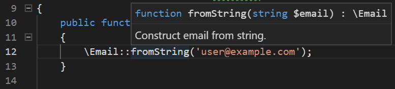
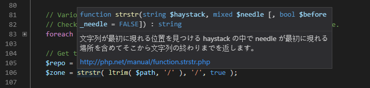

/*
Title: Tooltips
Description: Tool tip help
*/

# Tooltips

Mouse hovering over an expression or a declaration reveals additional information. The information is formatted respecting PHP syntax. In case the expression resolution is ambiguous, the tool tip lists all the possible meanings.

## User symbols

All of the user's code is analysed in order to determine possible types and corresponding symbols. The tooltip shows declaration of the symbol under the cursor, optionally with its actual value and type, or a combination of types.

In case the symbol is annotated with a PHPDoc comment, it is shown at the bottom of the tooltip as well.

## Non-user symbols (PHP Manual)

Tooltip shows the corresponding declaration and description, including a direct link to the PHP manual.

The description is shown in the user's current language. This can be changed in [settings](../configuration).

## Keywords, PHPDoc keywords

A short description of the keyword is shown in a tooltip.
