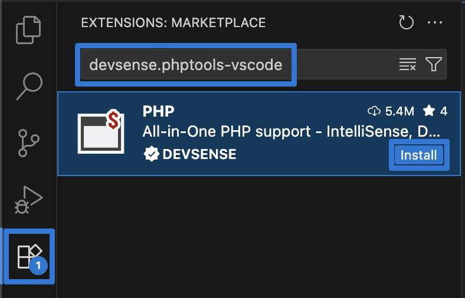

/*
Title: Installation
Description: Installing PHP Tools for Visual Studio Code.
*/

## Installation

The extension is installed through the Visual Studio Code' `Extensions` window.

- Navigate to `Extensions` view (`View` / `Extensions`)
- Search for `"PHP Tools"`
- Install the extension, and eventually reload your VS Code window.

After the successful installation, please [activate](#license-activation) your copy of PHP Tools.

## Offline installation

Download the `.vsix` installation file from [Visual Studio Marketplace](https://marketplace.visualstudio.com/items?itemName=DEVSENSE.phptools-vscode). The installation file has to be installed using the Visual Studio Code' `Command palette`, using the command `Extensions: Install from VSIX`.

## Pre-Release Installation

PHP Tools are released in a Stable and Pre-Release version. By default, the stable version is installed. The Pre-Release versions are updated more frequently, containing the most recent fixes and new features.

Navigate to the `Extensions` view, choose `PHP Tools`, and click `Install`. In case, there is a Pre-Release version available, `Install Pre-Release Version` will appear.
