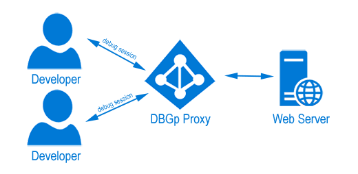

/*
Title: DBGp Proxy
Description: 
*/

# DBGp Proxy

The DBGp proxy is a solution for the situation when there are multiple developers that need to debug the same application on the same machine. Each developer from the team connects to the proxy and when the debug session is initiated, Xdebug connects to the proxy which then sends the connection to the right IP address - the correct developer.

## Installation

To download and configure DBGp proxy server please follow [STEP 1 - Download and install DBGp proxy](https://docs.devsense.com/en/vs/debugging/multi-user#step-1-download-and-install-dbgp-proxy) and [STEP 2 - Ensure Xdebug is installed and configured on the server](https://docs.devsense.com/en/vs/debugging/multi-user#step-2-ensure-xdebug-is-installed-and-configured-on-the-server) of the tutorial on [Multi-user debugging](https://docs.devsense.com/vs/debugging/multi-user)

## Configure VS Code to use DBGp proxy

Please see [launch.json](launch-json.md#dbgp-proxy-settings) on how to configure DBGp Proxy in the VS Code debug launch configuration.

## See Also

- [Getting Started](../index.md)
- [launch.json](launch-json.md) - VSCode+PHP debug launch configurations.
