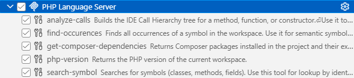

/*
Title: MCP Server
Description: Model Context Protocol Support
*/

# MCP Server

> Version 1.74 and newer.

The PHP extension provides an integrated MCP server that helps AI agents provide faster, better, and more cost-effective responses.

The MCP server provides MCP tools, skills, and contexts that AI agents such as Claude can use to access the same information that the PHP IDE knows internally.

## MCP Tools

By default, all provided tools are used by your agent. Click _Configure Tools_ in your Chat window to enable or disable tools:

The tools selection list:

