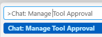
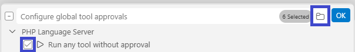

/*
Title: MCP Server
Description: Model Context Protocol Support
*/

# MCP Server

> Version 1.74 and newer.

> Supported on Visual Studio Code IDEs supporting `contributes.mcpServerDefinitionProviders` extension point. (VSCode, Cursor, Windsurf, Trae, ...)

The PHP extension provides an integrated MCP server that helps AI agents provide faster, better, and more cost-effective responses.

The MCP server provides MCP tools, skills, and contexts that AI agents such as Claude can use to access the same information that the PHP IDE knows internally.

## MCP Tools

By default, all provided tools are used by your agent. Click _Configure Tools_ in your Chat window to enable or disable tools:

The tools selection list:

## Call Tools without confirmation

Open _Command Palette_ (`F1`), and search for `Chat: Manage Tool Approval`:

- **Untick** the "Folder" button, so it applies for all your workpaces.
- **Tick** _Run any tool without approval_; so agents can run the tool to get extended information and tools for your projects without you confirming every action.

