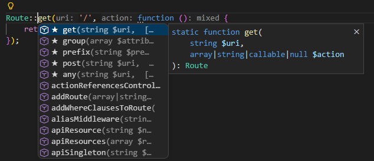

/*
Title: Starred Suggestions
Description: Local AI Completion Suggestions
*/

# Starred Suggestions

> This feature is available for **PREMIUM** users.

When completing object or class members (after typing `->`, `?->`, or `::`), the editor uses an extremely fast, fully local machine AI model to predict the most relevant methods, properties, or constants for the current context.

The top 5 most probable members are automatically sorted to the very top of the completion list and marked with a star icon (★) next to their name.



Because the prediction model runs entirely on your local machine, there is zero network latency, and your code never leaves your computer.

This behavior is enabled by default and can be disabled using the following setting:

```json
"php.completion.starredSuggestions": false
```