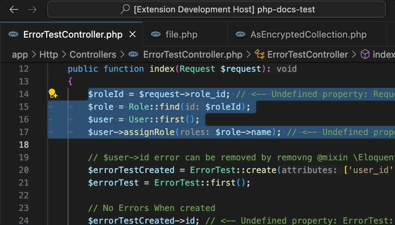

/*
Title: Extract Function
*/

# Extract Function

The _extract function_ refactoring takes a selection of code, moves it into a separate function or method (or constant), and asks for a new function (or constant) name.

1. Select a portion of code.
2. Open _Code Actions_ using a light bulb icon, or keyboard shortcut (by default `Ctrl + .` (Windows) or `Cmd + .`).
3. Select _Extract function_.
4. Enter a new function name and confirm with `Enter`.

## Extract Constant

If you select a constant value, instead of `Extract function`, there will be `Extract constant`.

## See Also

- [Code Actions Overview](overview.md)