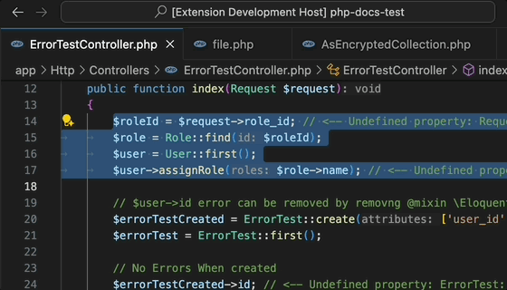
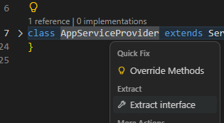
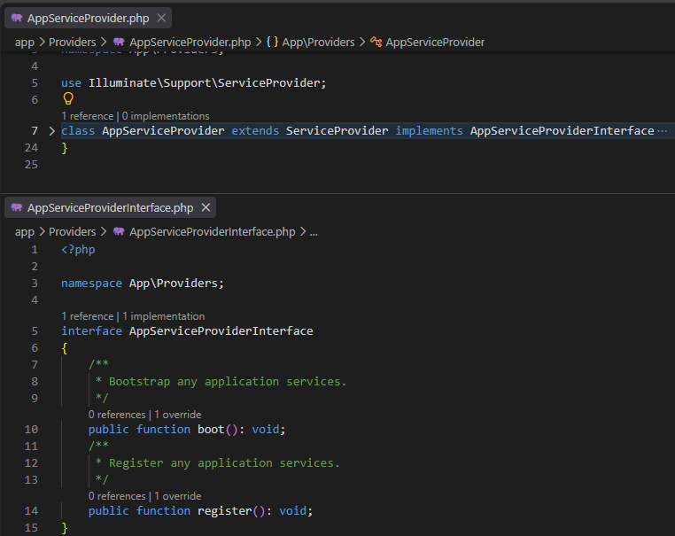

/*
Title: Extract Function &amp; Interface
*/

# Extract Refactoring

## Extract Function

The _extract function_ refactoring takes a selection of code, moves it into a separate function or method (or constant), and asks for a new function (or constant) name.

1. Select a portion of code.
2. Open _Code Actions_ using a light bulb icon, or keyboard shortcut (by default `Ctrl + .` (Windows) or `Cmd + .`).
3. Select _Extract function_.
4. Enter a new function name and confirm with `Enter`.

## Extract Constant

If you select a constant expression, instead of `Extract function`, there will be `Extract constant` code action.

## Extract Interface

> Available in `v1.73` and newer.

The `Extract Interface` code action is provided on a class header, if there are public class members that can be placed into an interface.

The code action creates a new interface in a new file, with `Interface` suffix, adds public declarations from the class, copies it's documentary comments, and adds the interface to the selected class automatically.

## See Also

- [Code Actions Overview](overview.md)
- [Code Actions List](list.md)