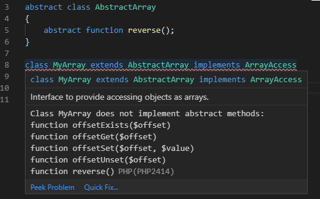
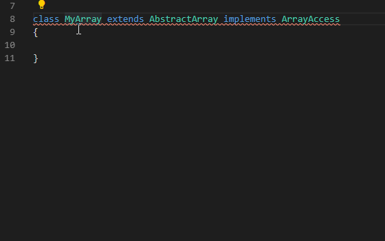
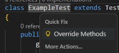
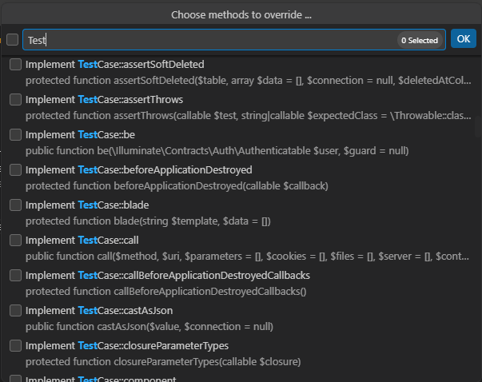

/*
Title: Implement Abstracts &amp; Overrides
*/
# Implement Abstracts

## Implement Abstract Methods &mp; Properties

Error `PHP2414` indicates that the non-abstract class has some functions or properties missing. The quick fix or code action automatically implements the missing abstract functions and properties, including all the available documentation and type information. The generated code is inserted at the end of the class.

The code action resolves the complete class hierarchy, taking into account interfaces and classes. Generated code contains PHPDoc annotations and base implementation of methods if applicable.

## Override Methods

Code action to generate function overrides analyzes your class hierarchy and lets you to select methods to override.

List of available overrides can be filtered, and selected signatures will be inserted into the class.

## Extract Function

See [Extract Function Documentation](./extract.md) for `Extract function` and `Extract constant` code actions.
