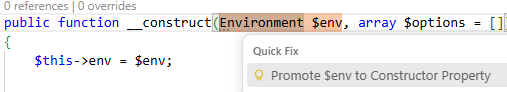

/*
Title: Promote Constructor Property
Description: Refactors a fields declaration into a promoted constructor property.
Tags: php,code actions,promote constructor property
*/

# Promote Constructor Property

> Available since `1.74`.

If appropriate, code action to change a field declaration to a promoted constructor property will appear.



The code action is provided if:

- [Selected PHP version](../php-version.md) is 8.0 or higher.
- The containing class has a field with the same name as the `__construct`'s parameter.
- The same field is being directly assigned to in the `__construct`.

Example:

```php
class MyClass {
    var $field;
    function __construct($field) {
        $this->field = $field;
    }
}
```

Code action will be provided anywhere on `var $field`, or `$field` parameter, or `$this->field = $field` expression.

## See also

- [List of all inline actions](./list.md)
- [Autofix](./autofix.md) - Configuring editor to automatically perform the quick fix on file save.