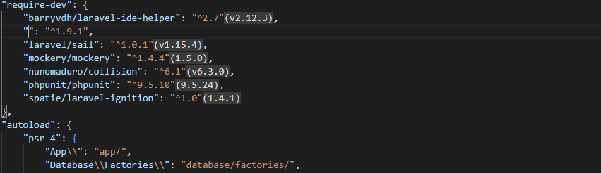
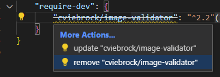
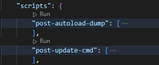
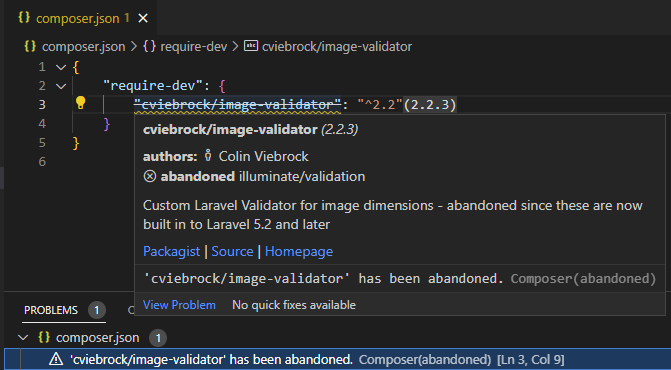

/*
Title: Composer
Description: Composer support in Visual Studio Code
*/

# Composer

## Installation

Composer _All-in-One_ is a part of **PHP Tools** extension. Although it can be installed separatelly from the [Composer](https://marketplace.visualstudio.com/items?itemName=DEVSENSE.composer-php-vscode) extension page.

## Composer.json Editor &amp; IntelliSense



- tooltips with package details
- completion package names from packagist with package details
- completion package versions
- package code actions - update, remove



- package installed version hint
- run script codelens



- diagnostics for abandoned packages



## Commands

Integrated commands work with the `composer.json` in the workspace root directory. If necessary, commands ask which workspace folder you're referring to. It allows quickly `require`, `remove`, or *search* for packages from packagist.org, and more.

The following commands are usually executed as a VSCode task, using `php` executable as configured in the `Settings`, and `composer.phar` downloaded automatically when necessary (so it is not necessary to install it by yourself).
    
### `composer: install`

### `composer: update`

### `composer: require`

### `composer: require-dev`

### `composer: remove`

### `composer: search ...`

### `composer: run-script ...`

### `composer: create-project ...`

### `composer: check-platform-reqs`
    
### `composer: update the internal composer.phar`

### `composer: about`

### `composer: archive ...`

### `composer: clear-cache`

### `composer: fund`

### `composer: licenses`

### `composer: outdated`

### `composer: reinstall`

## Tasks

VS Code task that executes a `composer` command is a useful way of configuring and running composer. The `composer.phar` itself is automatically installed, and `php` executable is determined from `Settings`.

_Example:_

```json
"tasks": [
    {
        "label": "check",
        "type": "composer",
        "command": "check-platform-reqs",
        "args": []
    }
]
```

## Schema Validation

The extension provides schema validation for `composer.json` files, maintained by [@composer](https://github.com/composer/composer).

- correctness validation.
- tooltips and code completion for `composer.json` JSON elements.

## Configuration

The extension automatically downloads `composer.phar` latest snapshot, and uses it. The location respects the Composer default installation path which can be changed by setting the `COMPOSER_HOME` environment variable.

| Setting | Description |
| --- | --- |
| `php.executablePath` | The value is used to determine `php` executable path for running composer commands. If not set, `"php"` is used by default.<br/><br/>In case, there is [PHP Tools](https://marketplace.visualstudio.com/items?itemName=DEVSENSE.phptools-vscode) extension installed, composer commands are executed using `php` set with [PHP Version Picker](https://docs.devsense.com/vscode/php-version). |

## Related links

- [PHP Tools Installation](installation)
- [Composer Extension](https://marketplace.visualstudio.com/items?itemName=DEVSENSE.composer-php-vscode) _(marketplace.visualstudio.com)_
