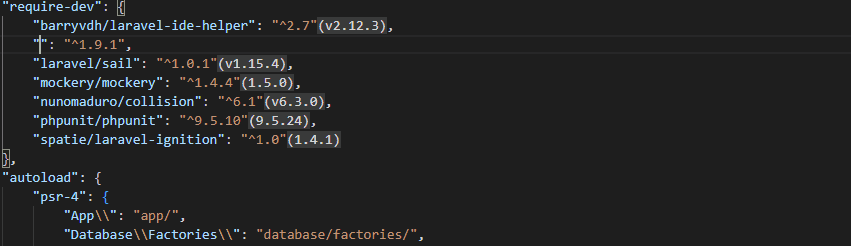
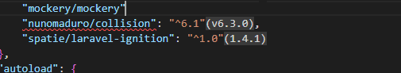
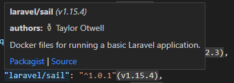
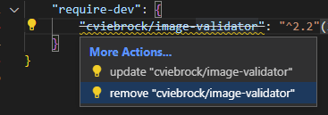
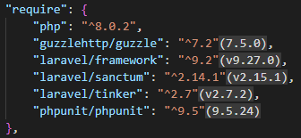
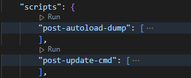
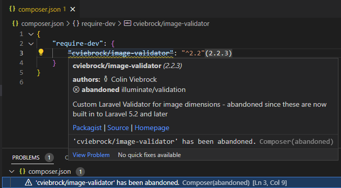

/*
Title: Composer
Description: Composer support in Visual Studio Code
*/

# Composer

## Installation

Composer _All-in-One_ is part of the **PHP Tools** extension. It can also be installed separately from the [Composer](https://marketplace.visualstudio.com/items?itemName=DEVSENSE.composer-php-vscode) extension page.

## Composer.json Editor &amp; IntelliSense

The `composer.json` editor is extended with smart actions, code lenses, tooltips, and IntelliSense to autocomplete packages and versions from _packagist.org_.

### Completion of Package Names

Code completion searches packages and lists their names with detailed information, including downloads, favorites, abandonment status, and descriptions. There are also quick links to the package _home page_, package _source_ code, and _packagist.org_ page.



### Completion of Package Versions

Available minor versions are fetched from _packagist.org_ and listed in code completion after the required package name:



### Tooltips

Installed package details are displayed in the tooltips.



### Code Actions

Quickly `update` or `remove` a package right from the editor by using code actions:



### Installed Version Inlay

The actual installed version is displayed conveniently next to the required package version:



### Run-Script CodeLens

The `"scripts"` section of `composer.json` gets a small CodeLens that allows you to quickly run the corresponding script right from the editor:



### Diagnostics &amp; Abandoned Packages

The extension watches installed packages and checks whether any of them are abandoned. Abandoned packages are listed in VS Code's **Problems** view with strikethrough text, and the tooltip shows the corresponding abandonment message:



## Commands

Integrated commands work with the `composer.json` file in the workspace root directory. If necessary, commands ask which workspace folder you are referring to. This lets you quickly `require`, `remove`, or *search* for packages from packagist.org, and more.

The following commands are usually executed as a VS Code task, using the `php` executable configured in `Settings`, and `composer.phar` downloaded automatically when necessary (so you do not need to install it yourself).
    
### `composer: install`

Runs the `install` command.

### `composer: update`

Runs the `update` command.

### `composer: require`

The `composer: require` command shows a quick pick with online search and installs the selected package. The search displays important information, including package descriptions, downloads, and favorites.


### `composer: require-dev`

Requires a **dev** package. This works the same as `composer: require`, but the package is installed as a development dependency.

### `composer: remove`

Removes one or more installed packages from the project. The command shows a quick pick with multi-selection, allowing you to choose the packages to remove:


### `composer: create-project ...`

Open an empty folder in VS Code and create a new project from a Composer package. The command shows a quick pick that searches online for available packages and invokes the `create-project` command for you:


### `composer: search ...`

Search for packages on _packagist.org_. Quickly browse packages, read descriptions, open details on packagist.org, or `require` a package right from the quick pick menu.


### `composer: run-script ...`

Quickly run your Composer script from the Command Palette:


### `composer: check-platform-reqs`

Checks whether your local PHP environment and installed extensions satisfy platform requirements declared by dependencies.
    
### `composer: update the internal composer.phar`

The extension automatically downloads the latest Composer installation and uses it for all tasks and commands. Run `composer: update the internal composer` to manually re-download the latest snapshot.

### `composer: about`

Shows information about Composer support.

### `composer: archive ...`

Runs the `archive` command and asks for arguments.

### `composer: clear-cache`

Clear the internal composer cache.

### `composer: fund`

Shows your required packages funding options.

### `composer: licenses`

Shows a summary of your required package licenses.

### `composer: outdated`

Shows a list of outdated packages.

### `composer: reinstall`

Runs the `reinstall` command.

## Tasks

A VS Code task that executes a `composer` command is a useful way to configure and run Composer. The `composer.phar` file is installed automatically, and the `php` executable is determined from `Settings`.

_Example:_

```json
"tasks": [
    {
        "label": "check",
        "type": "composer",
        "command": "check-platform-reqs",
        "args": []
    }
]
```

## Schema Validation

The extension provides schema validation for `composer.json` files, maintained by [@composer](https://github.com/composer/composer).

- Correctness validation.
- Tooltips and code completion for `composer.json` JSON elements.

## Configuration

If there is an existing installation of `composer.phar` in one of the following paths, it is used as-is:

- `/usr/bin/composer` (Linux/OsX)
- `/usr/local/bin/composer` (Linux/OsX)
- `${COMPOSER_HOME}/composer.phar`
- `.composer/composer.phar` under the user's home directory (Linux, OsX)
- `${APP_DATA}/Composer/composer.phar` (Windows)

Otherwise, the extension automatically downloads the latest `composer.phar` snapshot, uses it, and keeps it updated. The location follows Composer's default installation path, which can be changed by setting the `COMPOSER_HOME` environment variable.

### Additional Settings

| Setting | Description |
| --- | --- |
| `php.executablePath` | This value is used to determine the `php` executable path for running Composer commands. If it is not set, `"php"` is used by default.<br/><br/>If the [PHP Tools](https://marketplace.visualstudio.com/items?itemName=DEVSENSE.phptools-vscode) extension is installed, Composer commands are executed using the `php` version selected with [PHP Version Picker](https://docs.devsense.com/vscode/php-version). |
| `composer.workingPath` | The relative path to the `composer.json` file. |

## Related links

- [PHP Tools Installation](installation/index.md)
- [Composer Extension](https://marketplace.visualstudio.com/items?itemName=DEVSENSE.composer-php-vscode) _(marketplace.visualstudio.com)_
- [Create PHP Project using Composer in VS Code](https://blog.devsense.com/2022/create-php-project-composer-vs-code)
- [Introducing Composer for VS Code](https://blog.devsense.com/2022/composer-for-vscode)
