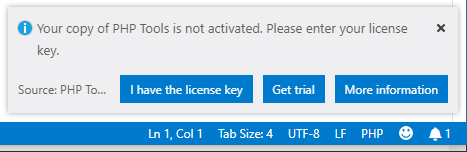
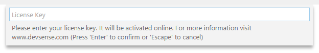
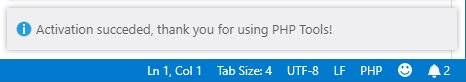

/*
Title: Configuración
Description: 
*/

## Instalación

La extensión se instala a través de la ventana principal de VSCode. Por favor, si necesita información detallada, vea [managing extensions in VS Code](https://code.visualstudio.com/docs/editor/extension-gallery).

Después de la instalación exitosa, se le pedirá [activar](#license-activation) PHP Tools.

### Instalación sin conexión

El archivo de instalación `.vsix` puede descargarse en nuestra [sección de descargas](https://www.devsense.com/download#vscode). Éste  archivo debe ser instalado utilizando `Command palette` de VSCode, comando `Extensions: Install from VSIX`.

El programa podría realizar una descarga adicional de dependencias durante el primer inicio, después de la instalación. Por favor, asegúrese de tener conexión a internet. En el caso de que su computadora no se pueda conectar, intente uno de los siguientes:

- Instale Microsoft .NET Core 2.x Runtime para su plataforma (más información en https://www.microsoft.com/net/download), o
- Descargue la dependencia manualmente. Vea la salida de VSCode, panel 'PHP', para el registro y la URL de la dependencia. Extraiga el archivo zip `/out/server` del directorio de instalación de la extensión.

## Opciones de configuración

Los siguientes ajustes se introducen gracias a la extensión. Si necesita verlos o modificarlos, debe navegar hasta los [Ajustes de VSCode](https://code.visualstudio.com/docs/getstarted/settings).

Ajuste | Valores | Descripción
---     | ---    | ---
`php.executablePath` | Ruta de acceso completa al programa `php`, o no establecido. | Especifica la ruta de acceso al programa `php` que será utilizado con el [Explorador de Pruebas](test-explorer) y la [Depuración](debug).
`phpTools.language` | "en", "de", "es", "fr", "ja", "pt", "ro", "ru", "tr", "zh", o no establecido. | Especifica el código de idioma de la documentación integrada. Si no se establece, la configuración predeterminada es el idioma del sistema.
`phpTools.license` | Clave de licencia codificada. | La licencia obtenida durante el proceso de activación en línea. Al valor se le aplicado hash para no exponer ninguna información personal. 

## Activación de la licencia

En caso de que la extensión no haya sido activada, una ventana emergente se muestra durante el inicio de la extensión. Esta ventana ofrece las siguientes opciones: 

- `I have the license key` le permite ingresar la clave de la licencia y activar la extensión.
- `Get trial` le envía un email con una clave de licencia válida por 14 días.
- `More information` abre la [página web](https://www.devsense.com/purchase) de información sobre la licencia y compra

Una vez que obtenga su clave de licencia y cierre la ventana emergente comentada más arriba, puede activar su copia de la extensión utilizando `Command palette`, comando `PHP Tools: Activate extension`. Ingrese su clave de licencia y confirme presionando `Enter`.

La activación requiere estar conectado al Internet. La instalación exitosa se confirma por medio de esta ventana emergente:

## Requisitos PHP 

Las funciones de las pruebas y de la depuración necesitan que el programa [PHP](https://secure.php.net/) esté instalado y configurado. Es recomendable utilizar PHP 7.0 o más reciente; sin embargo, las versiones de PHP desde 5.4 en adelante también son compatibles.

**Para ejecutar las pruebas y el servidor de desarrollo incorporado** se necesita `php` con las extensiones  `dom`, `json`, `mbstring` y `xmlwriter`. Para esto, debe instalarse `php` globalmente, para que el comando `php` trabaje por todo el sistema o establezca la configuración de `php.executablePath` en la configuración de VSCode apuntando al ejecutable de PHP.

**La depuración local** necesita que la extensión [Xdebug](https://xdebug.org/) esté instalada y habilitada. Vea [Xdebug configuration](debug/xdebug) para más información.

### Recomendamos

- PHP 7.0 o más reciente
- Extensiones PHP `dom`, `xsl`, `mbstring`
- Extensión PHP `xdebug` con las siguientes opciones en su `php.ini`:
  - `xdebug.remote_enable = 1`
  - `xdebug.remote_autostart = 1`

## Artículos relacionados

- [Configuración de Xdebug](debug/xdebug)
- [Managing extensions in VS Code](https://code.visualstudio.com/docs/editor/extension-gallery) *(visualstudio.com)*
- [VSCode Settings](https://code.visualstudio.com/docs/getstarted/settings) *(visualstudio.com)*
