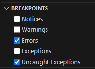

/*
Title: Exceptions and Errors
Description: Break on exceptions, warnings, and errors when they are thrown in PHP during debugging in Visual Studio Code
*/

# Exceptions and Errors

The **PHP Debugger** provides developers with tools to handle exceptions during the debugging process. This functionality enables you to break when all or specific exception happens during script execution. This allows you to inspect the state of your application precisely at the point where the error occurred.

# Handling Exceptions and Errors in VS Code

When developing PHP applications, you may encounter a range of issues, including notices, warnings, errors, and exceptions. From PHP 7 onwards, many errors are represented as exceptions, which can be managed more flexibly. The PHP Extension for Visual Studio Code enables effective handling of both traditional PHP errors and modern PHP exceptions.

## Breaking on Specific Exception Types

Visual Studio Code allows you to control which issues trigger a breakpoint during debugging. The **Breakpoints** panel offers a straightforward way to configure these settings. Available options are:

- **Notices**: Breaks when a PHP notice is triggered (e.g., accessing an undefined variable).
- **Warnings**: Breaks when a PHP warning occurs (e.g., including a file that does not exist).
- **Errors**: Breaks on PHP errors, such as fatal errors (e.g., calling a non-existent function) that stop the execution of the script.
- **Exceptions**: Breaks when a PHP exception is thrown, such as a custom throw or built-in exceptions like `RuntimeException`.
- **Uncaught Exceptions**: Breaks when an exception is thrown but not caught by any `try-catch` block, leading to script termination.

### How to Configure Exception Breakpoints

To set up exception breakpoints in Visual Studio Code:

1. Open your PHP project and navigate to the **Run and Debug** view.
2. Expand the **Breakpoints** panel.
3. Select the types of exceptions or errors you wish to break on during execution.



This ensures that when your PHP code encounters a specified issue, the debugger will pause, allowing you to inspect the program's state.

## Customizing Exception Handling in `launch.json`

For finer control over debugging behavior, you can modify the `launch.json` configuration file. The `ignoreExceptions` setting allows you to specify exception class names or patterns that should be ignored by the debugger.

### Example `launch.json` Configuration:

```json
{
    "configurations": [
        {
            "name": "Listen for XDebug",
            "type": "php",
            "request": "launch",
            "ignoreExceptions": ["MyNamespace\\SpecificException", "CommonError*"],
            "program": "${file}"
        }
    ]
}
```

This setup will prevent the debugger from breaking when `MyNamespace\\SpecificException` or any exception matching `CommonError*` is thrown.

## Viewing Exceptions in the Debug Console

Whether or not the debugger is set to break on an exception, you can still see output in the Debug Console when an exception or error occurs. For example, an uncaught exception will display:


## Unhandled Exceptions and Fatal Errors

Unhandled exceptions in PHP are treated as fatal errors, terminating the program if they are not caught with a `try/catch` block. The debugger will automatically break when such exceptions occur, giving you a chance to inspect the program state at the time of failure.