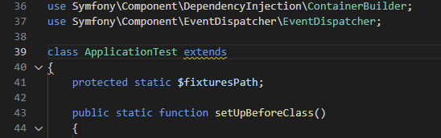
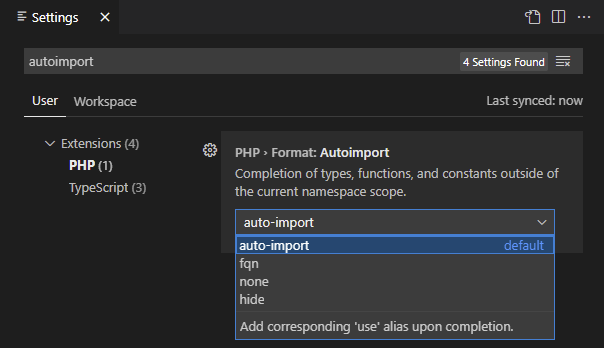

/*
Title: Auto Import
Description: Importing classes, functions, and constants from outside the namespace
*/

## Auto-Import on Code Completion

Code completion lists all the available types, functions, and constants that might be used in the current context. By default, symbols outside the current namespace scope are listed as well.

The editor automatically deals with symbols outside the namespace scope, and either adds the corresponding alias, inserts the fully qualified name (FQN), or does nothing.

### Setting

The behavior is configurable using the setting `php.format.autoimport`. See the *Settings* page for details:

It is possible to hide all the inaccessible names from the completion list by changing the `php.format.autoimport` setting to `"hide"`.

To disable the auto-import feature, set the `php.format.autoimport` setting to `"none"`.

All the available options are:

  - **auto-import** (default): automatically imports alias when completing types/function/constants out of the namespace scope. This adds corresponding `use` stamement into the current namespace or global scope.
  - **fqn**: inserts fully qualified name upon completion.
  - **none**: inserts simple name as it is.
  - **hide**: does not show inaccessible symbols in code completion at all.

## Import from Code Action

In case there is a missing import, a quick code actions is provided with available options. To open the *quick fix*, use either a shortcut (default `Ctrl`+`.`) or click onto a lightbulb icon. If there is a selection of code, all the quick fixes within the selection are shown.

The editor resolves all the available options, and provides the following:

- **fully qualify the name**: replaces the name with the fully qualified name.
- **import**: adds corresponding alias inthe the namespace or global scope.

## See also

- [Code Actions](code-actions.md)
- [Refactoring](refactoring.md)
