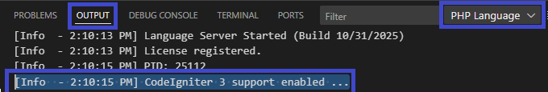
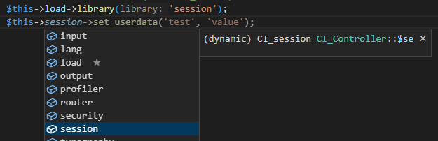
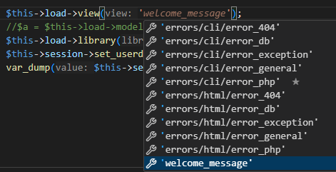
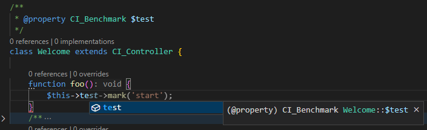
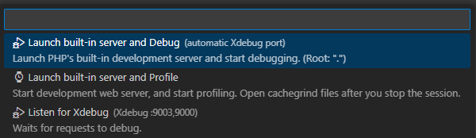
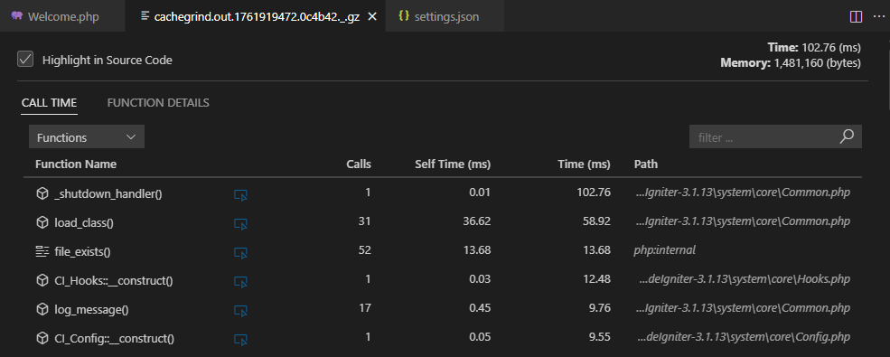

/*
Title: CodeIgniter 3
Description: Support for the CodeIgniter 3 Framework.
*/

# CodeIgniter 3

The lightweight and popular **CodeIgniter 3 (CI3)** framework has its own quirks and conventions that many PHP editors may not handle correctly.  
PHP Tools for Visual Studio Code now includes full, built-in support for CodeIgniter 3.

## Setup

There is **no setup required** to enable CodeIgniter 3 support in PHP Tools.  
Once you open a CI3 project in Visual Studio Code with the [PHP Tools extension](https://marketplace.visualstudio.com/items?itemName=DEVSENSE.phptools-vscode) installed, it will automatically detect the framework and enable all related features.

You can verify this in the **OUTPUT** panel:



### Recommendations

Although no setup is necessary, adding the following `.vscode/settings.json` file can improve your development experience:

```json
{
    "php.problems.scope": "all",
    "php.version": "7.4",
    "php.problems.exclude": {
        "system/": true,
        "vendor/": true
    }
}
```

- Analyze the entire code base ([PREMIUM](https://www.devsense.com/purchase)) for potential issues.
- Ensure the editor and debugger treat your code as compatible with PHP 7.4.
- Ignore problems in the `/system` folder, as CI3 has several known mistyped PHPDoc annotations that may generate false warnings.
- Ignore problems in the `/vendor` folder, especially in `/vendor/composer/ClassLoader.php`, which refers to the missing `apcu` extension.

## Code Completion

The editor automatically recognizes loaded **models**, **classes**, and **libraries**  
(starting from version _1.62_ pre-release and in all versions _1.63+_).  
This enables **typed property completion** for controller instances:



In addition, PHP Tools provides completion for **model names** and **view names**:



## Code Problems

Although the editor detects most common cases of loaded libraries and models,  
some dynamically created properties may still appear as *undefined* or *unknown*.

A recommended workaround is to annotate such properties using a PHPDoc comment above your controller:



## Run &amp; Debug

> Requires the [`Xdebug`](../debug/index.md) PHP extension.

You can start debugging immediately — no configuration or launch profile is required.  
Simply press **F5** to run the application:



This command starts PHP’s built-in development server using your local PHP binaries  
and automatically opens the application in your browser.

To customize how your application starts, refer to the [Launch Profiles](../debug/launch-json.md#built-in-php-server) documentation.

## Profile a CodeIgniter 3 Application

> Requires the [`Xdebug`](../debug/index.md) PHP extension.  
> Requires the [PHP Profiler](../profiling.md) VSCode extension (installed by default).

You can profile a CI3 application using the same start menu (**F5**) or using a [Profiling Launch Profile](../debug/launch-json.md#profiling-mode).

