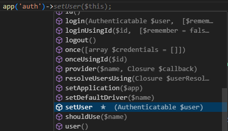

/*
Title: Laravel
Description: Using Laravel in PHP extension for Visual Studio Code
*/

# Laravel

> [PHP extension](https://marketplace.visualstudio.com/items?itemName=DEVSENSE.phptools-vscode) version >= `1.55`.

Support for Laravel framework is built-in. The editor provides additional code completion, navigation, syntax highlighting, `.blade.php` editor, code formatting style for Laravel, and debugging using built-in server.

## Blade Templating


The editor for `blade.php` files is extended with PHP syntax support, code folding, Blade directives completion, Laravel Components and Livewire Components completion and navigation, and Blade file formatting.

### Blade File Formatting

The formatter is built-in and provides code formatting for HTML, CSS, JS, and PHP, and the structure of Blade file. Use `Format Document` editor command.

The configuration respects configurations of PHP, HTML, JS, CSS settings in VSCode respectively, and no additional setting is needed.

### PHP Editor inside Blade Directives


Nested PHP code inside `.blade.php` files is treated as regular PHP code - all the PHP editor features are enabled including code completion, navigation, tooltips, diagnostics, inlay hints, code lenses, or formatting.

### Blade Directives Completion


Common Blade directives are completed upon typing `@` character. Completions representing a snippet are annotated with a _snippet_ icon.

### Components Completion and Navigation


Blade views and components are scanned in default Laravel directories. View classes and `.blade.php` files are suggested using the Laravel view notation:

- As HTML tags after `<x-`, or inside `@include`, `@each` and other directives.
- Liveware components after `<livewire:`, and inside `@livewire()` directive.

- In `view()` function.


Component attributes defined as view class properties, view `@props`, or Livewire `mount()` parameters are suggested/navigated to.


## Facades, Services, and Class Aliases

The editor recognizes class aliases such as `Route` defined across Laravel framework and in `app` configuration. Class aliases are listed in PHP code completion togeher with other symbols.



Laravel is heavily based on service containers and dependency injection. Registered Laravel services from across the Laravel project are recognized and used for additional code completion after `app()` or in Laravel facades.


The editor traverses through Laravel Facades, their accessor service, and recognizes completion methods. In case the facade accessor service can't be recognized using static code analysis, annotate the Facace class with `@mixin` PHPDoc keyword, for example:

```php
/ ** @mixin \Illuminate\Cache\Repository * /
class Cache extends Facade { ... }
```

## Eloquent Models


Eloquent models have full code completion including extensive generic types inferrence. Note, this works best in newer Laravel framework versions since they are better annotated.


Code completion provides local-scoped functions out of the box, without any additional annotation or configuration needed.

## Completion and Navigation in Laravel-Specific Functions


Special Laravel functions such as `__`, `lang`, `@lang()` blade directive, `storage_path`, `asset`, `view`, `route`, and others have additional code completions and navigations.


## Laravel Code Formatting Style

Please see [Code Styles](../editor/code-styles.md) and make sure to switch to `Laravel` code style to enable all Laravel formatting rules.


## Debugging using Built-in Server

> Please see [debugging overview](../debug/index.md) for configuring PHP and [Xdebug](https://xdebug.org/) binaries first. Note, you don't need additional VSCode extensions.

### Without Launch Profile

Without `.vscode/launch.json` launch file, simply press `F5` (Run / Start Debugging) with any opened `.php` file. VSCode will popup the following pre-configured profiles which initiate built-in Web Server with debugging enabled for the Laravel application.


`Launch built-in Server and Debug` starts built-in development Web Server (using [selected PHP](../php-version.md)), with Laravel routing, `.env` file, and debugging enabled.

### Launch Profile


For more customization, create a [launch profile](https://code.visualstudio.com/docs/editor/debugging#_launch-configurations), and select PHP. The profile will be pre-configured for use with Laravel.

> Please watch DEBUG CONSOLE winow for the development server log, or issues.

## See Also

- Selecting PHP Version: [PHP Version](../editor/php-version-select.md)
- Configuring code diagnostics: [Problems](../problems/configuration.md)
- Installing packages using Composer: [Composer](../composer.md)
- Running PHPUnit Tests: [Test Explorer](../test-explorer.md)
- Code Formatting Style: [Code Styles](../editor/code-styles.md)
