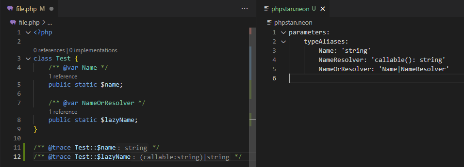

/*
Title: PHPStan
Description: Compatibility with PHPStan annotations.
*/

# PHPStan

## Annotations

The editor recognizes and respects wide range of PHPDoc annotations introduced by PHPStan, including generics and various structured types.

## Local Aliases

Type aliases introduced using `@type` or `@phpstan-type` PHPDoc annotation are respected.

## `phpstan.neon` Global Aliases

> Since version `1.56`

NEON is a simplified YAML file format. [`phpstan.neon`](https://phpstan.org/config-reference#neon-format) (or `.dist`  `.dist.neon`) files are indexed and [`typeAliases`](https://phpstan.org/writing-php-code/phpdoc-types#global-type-aliases) definitions are respected.
