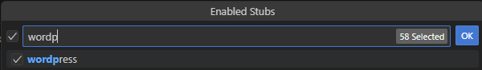

/*
Title: WordPress
Description: Using WordPress in Visual Studio Code
*/

# WordPress

## Plugin Development

If you open your WordPress plugin in VS Code, the editor will complain about missing declarations from the core WordPress source code.

**Enable WordPress Stubs**: go to Command Palette (`F1`) / `PHP: Workspace Stubs` / search for `"wordpress"`, and confirm with `OK`:
  

**Include Additional Libraries**: when developing a plugin depending on other plugins, there are two options:
  
  - Add folder with the depending plugin to your VSCode Workspace. Use menu command `Add Folder to Workspace ...`
  - Or set path to the depending plugin using setting `"php.workspace.includePath"`.

## Related Links

- Blog post: [WordPress IntelliSense and Linting](https://blog.devsense.com/2023/wordpress-intellisense-linting-vscode/)
