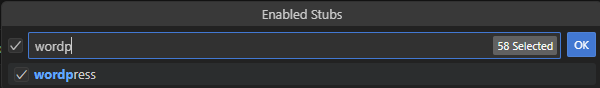
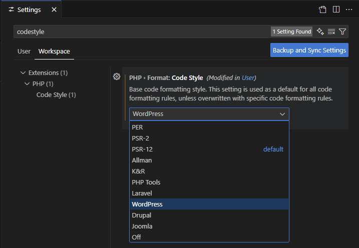
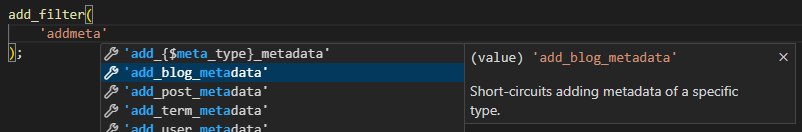
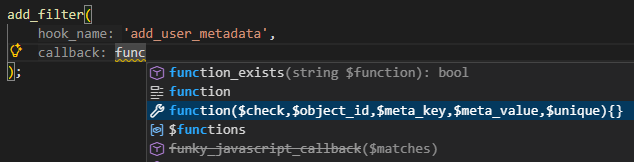
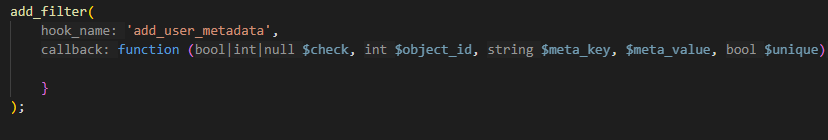

/*
Title: WordPress
Description: Using WordPress in Visual Studio Code
*/

# WordPress

## Plugin Development (without WordPress core)

When you open a standalone WordPress plugin in VS Code, the editor may report missing declarations from WordPress core.

**Enable WordPress stubs**: Open Command Palette (`F1`), run `PHP: Workspace Stubs`, search for `"wordpress"`, and confirm with `OK`:
  

**Include additional libraries**: If your plugin depends on other plugins, use one of these options:
  
  - Add the dependent plugin folder to your VS Code workspace using `Add Folder to Workspace...`.
  - Set the path to the dependent plugin using `"php.workspace.includePath"`.

### Quick Setup Checklist

- Enable the `wordpress` stub package in `PHP: Workspace Stubs`.
- Add dependent plugin folders to the workspace, or configure `"php.workspace.includePath"`.
- Select the WordPress formatting style (see below).

## Formatting

Choose the pre-configured code style [`WordPress`](../formatting/code-styles.md#wordpress) using the setting `"php.format.codeStyle"`.

## Editor Assistance

### WordPress Hooks Completion

> Available in v1.68 and newer.

The functions below provide hook-name suggestions from both built-in WordPress hooks and hooks discovered in your workspace:

- `add_filter`
- `apply_filters`
- `apply_filters_ref_array`
- `has_filter`
- `remove_filter`
- `remove_all_filters`
- `doing_filter`
- `did_filter`
- `add_action`
- `do_action_ref_array`
- `has_action`
- `remove_action`
- `remove_all_actions`
- `doing_action`
- `did_action`
- `do_action`

Hook names that contain placeholders (for example, `add_{$meta_type}_metadata`) are inserted as snippets with editable placeholder fields.

### WordPress Hook Callback Completion

When you add a filter or action, completion can suggest an anonymous function snippet:

### WordPress Hook Parameters Inlay Hints

With inlay hints enabled (`"editor.inlayHints.enabled"`), the editor adds parameter type information to callbacks based on the corresponding hook signature:

## Related Links

- Blog post: [WordPress IntelliSense and Linting](https://blog.devsense.com/2023/wordpress-intellisense-linting-vscode/)
- Code Styles: [Formatting/Code Styles](../formatting/code-styles.md)