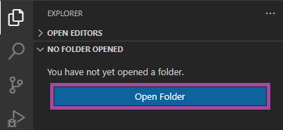
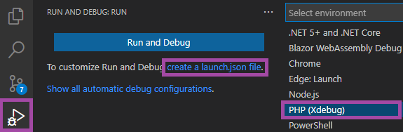
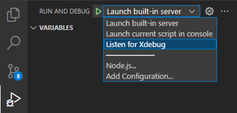

/*
Title: Getting Started
Description: PHP Tools for VS Code - Getting Started.
*/

# Getting Started

Welcome to PHP Tools for Visual Studio Code. This extension turns your Visual Studio Code into a powerful PHP development environment, including code editor, debugger, built-in server, and PHPUnit tester.

## Product Activation

The product is licensed to our active subscribers. See [the purchase page](https://www.devsense.com/purchase) for more information.

Open the `Command Palette` from the `View` menu and search for the command `PHP Tools: Activate extension`. Enter the license key into the pop-up window below and press `Enter`. Note: the activation process requires an Internet connection.

## Opening a Folder

**`Open Folder`** with the PHP application to get the most of the extension.

*The opened folder allows to initiate debugging, provides complete code completion, navigation features, code problems analysis, and allows for additional workspace settings like formatting and used PHP version, and more.*

## Enable Debug

Create launch settings, so VS Code will run and debug the PHP. Navigate to **`Run and Debug`** view, and create a new `launch.json` file. If asked for the environment, select **`PHP (Xdebug)`**.

This create a default launch settings with common launch profiles:

- `Launch built-in server` starts PHP development server within your opened folder, checks for the debugging capabilities, and starts listening for the Xdebug connections.
- `Launch current script in console` runs and debugs the currently opened PHP document as a console PHP program.
- `Listen for Xdebug` starts debugging and waits for an incoming Xdebug connection.

The launch profiles and corresponding settings can be added, removes or edited in the created `.vscode/launch.json` file.

## Configuring PHP

The vast majority of the extension's features work out of the box. The debugger and test explorer functionalities require, however, a working installation of [PHP](https://secure.php.net/) together with [Xdebug](https://xdebug.org/) extension.

See [selecting PHP version](/vscode/php-version) for more information.

## See Also

- [Configuration](/vscode/configuration)
- [Selecting PHP version](/vscode/php-version)
- [Test explorer](/vscode/test-explorer)
- [Debug](/vscode/debug)
- [Editor](/vscode/editor)
