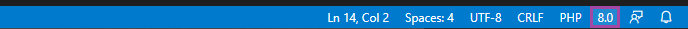
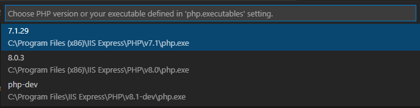
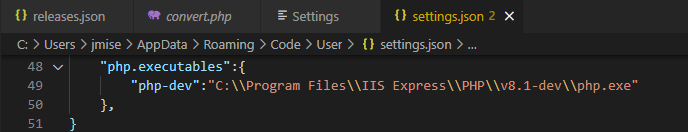

/*
Title: PHP Version
Description: PHP Tools for VS Code choosing the PHP version.
*/

## PHP Requirements

*PHP Tools Editor does not require `php` to be installed on the system. Although, for debugging, testing, and launching the PHP application, `php` is required. This page shows how to choose what `php` will be used by the debugger, the built-in server, the test explorer, and the other features that require a PHP binary or a PHP version to work with.*

## Choosing PHP Version

The editor, debugger, and also the test explorer respects and use the configured `php` executable. By default, the `php` command is used, if available on current environment. Although, PHP Tools allows to choose and manage `php` binaries on the system.

Also, features like code validation and code completion respects the chosen `php` version in order to provide more precise results.

### PHP Version Picker

To see what PHP version is the editor using, open a `.php` file, and check the Visual Studio Code status bar:



Clicking the PHP version number opens the **PHP Version Picker**:



### PHP Version Setting

This setting can be modified either using the PHP Version Picker (above) or manually by editing the Visual Studio Code Settings (`settings.json`), the `"php.version"` directive:

```json
{
    "php.version": "8.0",
}
```

The value can be either in format "major.minor", or more specific "major.minor.build". Alternatively, when defininig custom PHP paths (below) with identifier, the setting can refer to a custom identifier, for example:

```json
{
    "php.version": "myphp",
}
```

## Custom PHP paths

In case, PHP is installed in a non-standard custom location, custom path can be specified in order to let PHP Tools to find it and use it.

Open the Visual Studio Code Settings (File / Preferences / Settings). Switch to "User" scope, and look for "php.executables" setting:


Edit the "php.executables" setting:



The "php.executables" setting contains pairs of { *`"identifier"`* : *`"php binary path"`* }.

The specified identifier can be used by PHP Tools in PHP Version Picker (above), the debug launch configuration, or "php.version" setting in general. The version of PHP is automatically detected, and the editor will adjust to that.

## Related Links

- [Configuration](configuration) - Configuring the environment.
- [Debug Configuration][debug/launch-json] - Configuring the launch profile.
