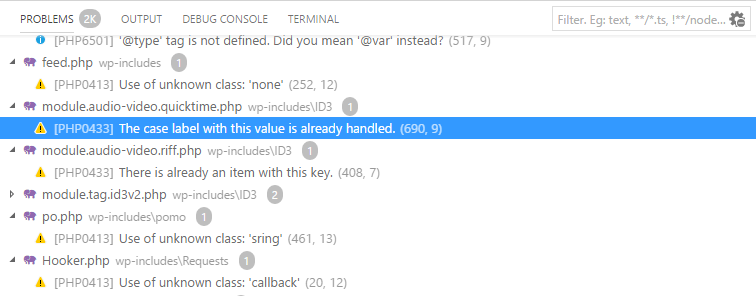

/*
Title: Problemas
Description: Problems and code validation
*/

# Problemas y Validación de código

Toda el área de trabajo es analizada continuamente para buscar potenciales inconvenientes o problemas. Éstos se enumeran en la ventana Problemas de VSCode, donde el usuario puede filtrarlos y navegar hasta cada uno de ellos.

## Configuración

No hay opciones de configuración para la función de Validación de código.

## Artículos relacionados

- [Code validation reference](/code-validation/)
