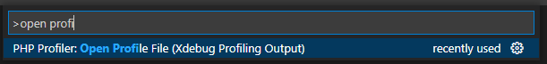
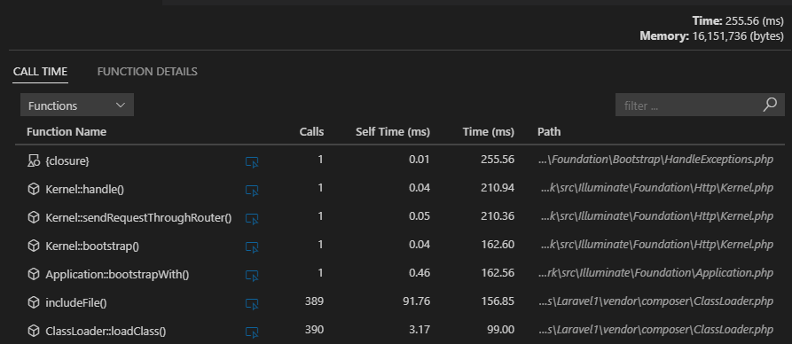
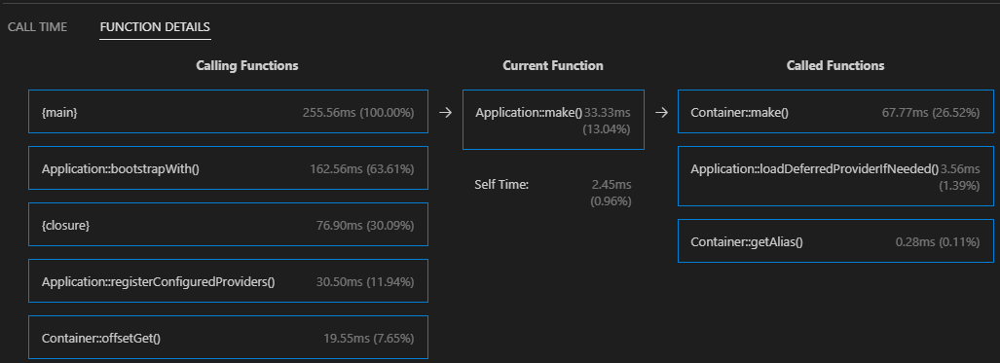
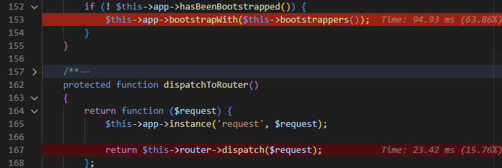

/*
Title: Profiler
Description: Detect, analyze, and optimize slow and resource-consuming methods and classes in your code with the PHP profiler for Visual Studio Code.
*/

# Profiler

PHP code profiling allows you to inspect how much time and how many calls were made to every single function in the code.

[**Get the PHP Profiler Extension**](https://marketplace.visualstudio.com/items?itemName=DEVSENSE.profiler-php-vscode)

---

### Quickly Setup PHP for Profiling

- Ensure, you have PHP installed.
- Ensure [Xdebug](https://xdebug.org/docs/install) PHP extension is installed as well.
- Make sure PHP `zlib` extension is enabled (recommended).
- Check your `php.ini` setting:
    ```ini
    xdebug.output_dir="<an output directory>"
    ```
- Use the following [`launch.json`](debug/launch-json) setting:
    ```json
    {
        "name": "Launch Built-in server & Profile",
        "type": "php",
        "request": "launch",
        "runtimeArgs": [
            "-S", "localhost:8888", "-t", "."
        ],
        "noDebug": true, // <-- disable debugging
        "profile": true, // <-- enable profiling
    }
    ```

After launching the built-in server using the launch configuration above, do a request to the web application. A new profile file (`cachegrind.out.*.gz`) will be created.

## Opening Profiling Result

Open the file containing your profiling data. By default, it is in form of `cachegrind.out.*.gz`.

**Using Command Palette**

- Bring the **Command Palette**, and run `Open Profile File (Xdebug Profiling Output)`.
- Choose the file, and confirm.
  

**Drag & Drop 'cachegrind.out.\*.gz' File**

Alternatively, if your profile file name is in form of `cachegrind.out.*.gz`, you can open the file right in the Visual Studio Code editor - using `File`/`Open File` menu.

> Be aware, large files may take some time to open.

## Inspecting Call Times

The following view lists all the functions with the number of calls (_Calls_), time spent by the function body (_Self Time_), and time including nested calls (_Time_).



## Inspecting Callers/Callees

The **Function Details** view is focused on a single function; and displays all the calling functions and all the called functions, including the time information.



## Highlighting Hot Paths

The loaded profiling result file is analyzed, and hot paths are highlighted directly in the source code. Highlighting can be turned off in the profiling result view.



## See Also

- [Debug](debug)
- [launch.json](debug/launch-json)
