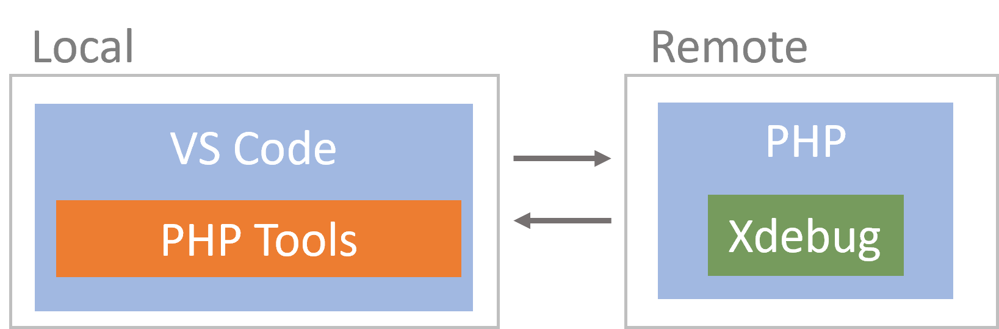
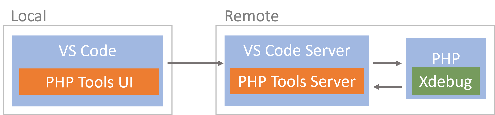

/*
Title: Remote Development
Description: Developing PHP remotely with VS Code
*/

# Remote Development

PHP Tools for VS Code can work with a remote system in two modes:

 - VS Code runs fully in the local environment communicating with PHP on a remote system
 - VS Code client runs locally, but VS Code server is on a remote system.

## VSCode runs fully on a local system

This scenario is a well-known approach to have a development system on a local machine, but run and debug on a remote machine, which is as close to the production environment as possible. There has to be some kind of mechanism in place to have source code in sync with both environments.



### Configuration

1. Xdebug configuration

   Locate the appropriate configuration file with Xdebug configuration. It can be `php.ini` or `xdebug.ini`. Run `php --ini` will help.

   Update the configuration so the `xdebug.client_host` contains your local system IP and make sure it's accessible from the remote server.

   ```ini
   xdebug.client_host=LOCAL_SERVER_IP
   xdebug.client_port=9003
   ```

   In case multiple developers require access to the remote server you'd need [DBGP proxy](debug/dbgp-proxy).

2. Launch profile

   Alter your `launch.json` file and provide it with `pathMappings` for a debugger to know how to map remote paths to local paths. 

    ```json
    {
        "name": "Listen for Xdebug",
        "type": "php",
        "request": "launch",
        "port": 9003,

        "pathMappings": {
            "/var/www/html": "${workspaceRoot}\\html",
        }
    }
    ```

    Follow [**`launch.json`**](debug/launch-json) for more information about the launch profiles and related configurations.

3. Restart the remote server. 

    For Apache, it would be `sudo service apache2 restart`

## VS Code Server runs on a remote system

This scenario is superior to the previous one because you are actually working remotely. This has many benefits; no source code needs to be on your local machine, no need to configure Xdebug to connect to the local system and `launch.json` will not require path mappings. But it doesn't end there, you are getting remote testing support and terminal of the remote machine while maintaining full IntelliSense, navigation and refactoring capabilities.



For this to work you would need [Remote Development extension pack](https://aka.ms/vscode-remote/download/extension), which contains three extensions, each supporting a different remote scenario:

- [WSL](https://aka.ms/vscode-remote/download/wsl) - Full Linux experience in the Windows Subsystem for Linux
- [SSH](https://aka.ms/vscode-remote/download/ssh) - Connect to a remote machine through SSH
- [Container](https://aka.ms/vscode-remote/download/containers) - Develop inside a docker container
   
   We've prepared a detailed tutorial for this scenario - [How to develop PHP inside a Docker Container using VS Code](https://blog.devsense.com/2022/develop-php-in-docker)

   If you have VS Code and [Docker Desktop](https://www.docker.com/products/docker-desktop/) installed, you can start quickly by clicking on this button:
    <div>
    <a class="btn btn-primary" href="vscode://ms-vscode-remote.remote-containers/cloneInVolume?url=https://github.com/DEVSENSE/vscode-remote-sample-php">Quick Start NOW!</a>
    </div>

## Related links

- [How to develop PHP inside a Docker Container using VS Code](https://blog.devsense.com/2022/develop-php-in-docker)
- [Launch Profiles](debug/launch-json)
