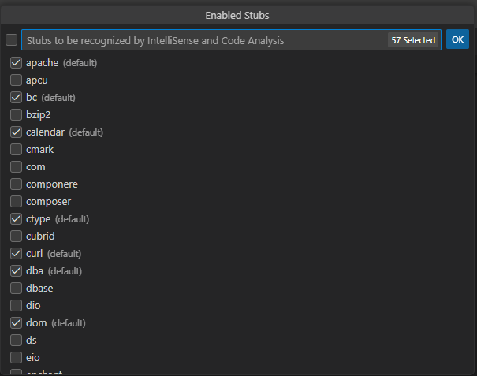

/*
Title: Stubs and Packages
Description: Including PHP extension stubs, custom stubs, and composer packages.
*/

## Workspace Stubs

Stubs are definitions from outside your project, usually not containing complete PHP code. In order to get complete code completion, code diagnostics, refactorings, inlay hints, and all the other editor features, _stubs_ for all the used extensions and other external symbols should be included in your workspace.

Stubs can be obtained in various ways. There are stubs for standard PHP extensions, stubs for well-known PHP native extensions, or stubs for whole frameworks like `WordPress`.

### Command `> Workspace Stubs`

Use the command from VSCodes' _Command Palette_ (`F1`) `Workspace Stubs`:

There you can enable or disable stubs for standard PHP extensions, and a few additional stubs including `wordpress`, `composer`, or `php-amqp`.

### Workspace Stubs Language

Most of the stubs selected here are provided translated in all major languages including _English, German, Spanish, French, Italian, Japanese, Russian, or Chinese_. The language is set automatically based on your IDE UI language. The language can be overriden using the setting `"phpTools.language"`.

### Setting `"php.stubs"`

The setting `"php.stubs"` is equaivalent to the `Workspace Stubs` command.

### Add Stub Code Action

Whenever there is a function from a stub, which is not included yet, you can use a quick code action to include the corresponding _stub_.

### Composer.Json' `ext-`

If using the Composer package manager, `composer.json` can optionally specify required PHP extensions (see [composer.json schema#require](https://getcomposer.org/doc/04-schema.md#require:~:text=PHP%20extensions%20your%20project%20needs)).

The editor respects the `"require"` and `"require-dev"` sections and includes stubs for extensions listed there automatically.

### Composer Packages

Various other stubs are available as composer packages. Add them as development requirement (`"require-dev"`) to your project using [`composer: require-dev`](./composer.md#composer-require-dev) command.

### Custom Stubs

Additional 3rd-party stubs provided as a `.php` file with definitions can be placed wherever inside the workspace. The editor will process the files and utilize the containing definitions.

## See Also

- [Composer Integration](./composer.md)
- [WordPress Stubs and Linting](https://blog.devsense.com/2023/wordpress-intellisense-linting-vscode/)
