/*
Title: Test Explorer
Description: Visual PHPUnit test explorer
*/

# Test Explorer

The _Test Explorer_ view enables execution, debugging, profiling, and code coverage of PHPUnit/ParaTest/Pest tests. Results are displayed conveniently in the **Test Explorer**, as shown in the picture below. Additional logs can be viewed in the **PHP (Test Explorer)** OUTPUT panel.


Each test is listed in the Test Explorer. Test methods are also annotated with the test icon right in the code showing current test status and quick actions.

## Configuration

Running tests requires an installed [PHP](php-version.md) (`php`) with [Xdebug](https://xdebug.org/), corresponding PHPUnit/Para/Pest package (e.g. `phpunit/phpunit`) and a [PHPUnit configuration file](https://docs.phpunit.de/en/10.5/configuration.html) (`phpunit.xml` (`.dist`)).

Tests are resolved without running `php` from corresponding `.php` files in the workspace. Any changes to those files will automatically update the _Test Explorer_ accordingly.

### PHP

Running the tests relies on the configured PHP executable. See [Selecting PHP Executable](editor/php-version-select.md) for more details.

### PHPUnit

The PHPUnit phar file or PHPUnit or Para or Pest composer packages are necessary to execute the tests. Test Explorer lookups the following locations, in order:

1. `"phpunit.phpunit"` setting (can be relative to the workspace folder).
  ```json
  {
    "phpunit.phpunit" : "${workspaceFolder}/phpunit"
  }
  ```
2. `{**/bin/pest,**/bin/para,**/bin/phpunit,**/phpunit/phpunit,**/phpunit.phar}` paths. If more files matching the pattern are found, the shortest one is preferred.

Watch the `OUTPUT` window, `PHP (Test Explorer)` for details.

### Custom Command

Running PHPUnit can be customized using the setting `"phpunit.command"`.

_Default value:_ `"\"${php}\" ${phpargs} \"${phpunit}\" ${phpunitargs}"`

The string command can have the following variables:

`${phpunit}` - will be replaced with phpunit binary path.
`${phpunitxml}` - will be path to corresponding `phpunit.xml`.
`${phpunitargs}` - the arguments we provide, including generated filters for executing specific tests or groups.
`${php}` - resolved path to php executable.
`${phpargs}` - the default arguments for php we provide.
`${cwd}` - current working directory.

See the VSCode's `Output` > `PHP (PHPUnit)` tab for details.

### Configuration File

The tests rely on the `phpunit.xml` or `phpunit.xml.dist` configuration files ([PHPUnit configuration](https://phpunit.de/manual/6.5/en/appendixes.configuration.html)), which should be placed in the root of the workspace.

### Tests

The name, location, extension and settings of the tests are defined in the `phpunit.xml` configuration file. 
The tests should be located in a sub-directory, not directly in the workspace root, because PHPUnit does not recognize them there.

## Test Explorer View

Test Explorer View provides tools for manual and automatic test execution with visual representation of the results. The view is only visible if there are some tests or the `phpunit.xml` configuration file in the workspace.


## Debugging Tests

Tests can be debugged with Xdebug by clicking the bug-like icon  in the Test Explorer view, or *Debug Test* command in the test margin. The debugging process is the same as [standard debugging](debug/index.md). The Test Explorer can debug one or more tests at once.


### Custom Debug Launch Profile

Specify a new `"php"` or `"phpunit"` launch profile in `.vscode/launch.json` file, and use it for debugging tests in Test Explorer.

**Example `launch.json` file:**

```json
{
    "configurations": [
        {
            "name": "Debug With Mapping",
            "type": "php",
            "request": "launch",
            "pathMappings": {
                "/var/www/html": "${workspaceFolder}"
            },
            "ignoreExceptions": ["NotSupported*"]
        }
    ]
}
```

**Notes:**

- the profile must have `"name"`
- `"type"` must be either `"php"` or `"phpunit"`
- there must not be `"program"` property

The custom (launch.json) profile will be listed in Test Explorer, under **Debug** menu:

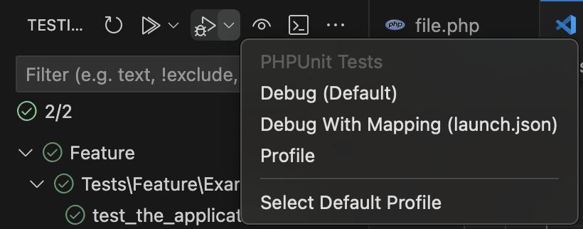

## Profiling Tests

> Note: Requires _PHP Profiler_ extension which is installed by default, but can be disabled or uninstalled.

Use the **Debug** menu in Test Explorer to Profile tests, or profile a single test with right click on the test -> `Debug with Profile` -> `Profile`.

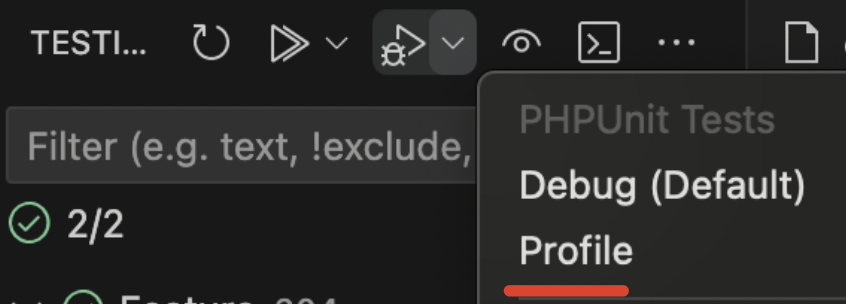

Browse through the profiling results which open after the session ends:

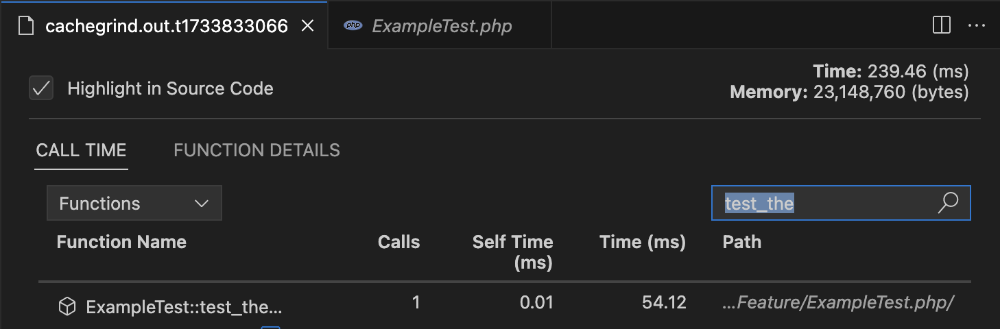

While the profiling results are still opened, see the hot paths in your code:

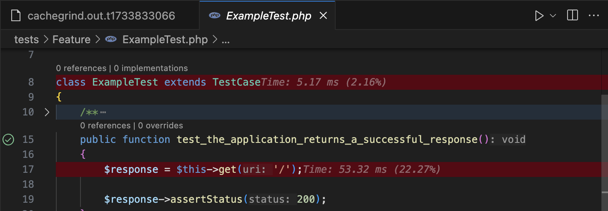

**Notes:**

- [Xdebug PHP extension](debug/index.md) needs to be properly installed
- [Profiler VSCode extension](https://marketplace.visualstudio.com/items?itemName=DEVSENSE.profiler-php-vscode) needs to be installed.
- See [profiling](profiling.md) for more details.

### Profiling on Remote Machine

Code profiling creates a temporary file on the machine which runs the actual `php`.

In case you're profiling tests run on a remote machine, you need to create a launch profile with `"pathMappings"` property. **Note**, this is not needed if you are connected directly to the remote machine via VSCode's _Remote Window_.

_Example `.vscode/launch.json` profile:

```json
      {
          "name": "My Remote Debug",
          "type": "php",
          "request": "launch",
          "pathMappings": {
              "/var/www/html": "${workspaceRoot}"
          },
      }
```

Then select the corresponding _Profiling_ profile in the Test Explorer debug drop down menu:

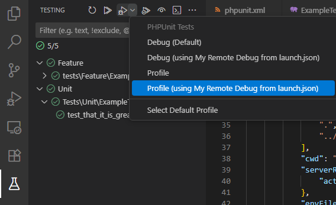

## Code Coverage

> Note: Available since version _1.62_.

> Note: [Xdebug PHP extension](debug/index.md) needs to be properly installed

Code Coverage tracks parts of the source code being actually used during tests. Run tests in "coverage" mode using the "Run Tests with Coverage" button, or a context menu.

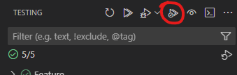

After tests are finished, a "Test Coverage" panel appears below the _Test Explorer_ with all the files being tracked during tests execution. **Note,** what files are listed relies on your `phpunit.xml` configuration.

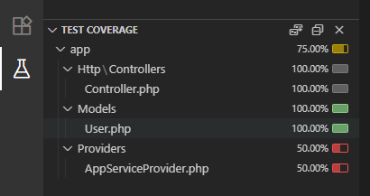

The coverage information is also displayed right in the _Explorer_, and source code editor as well:

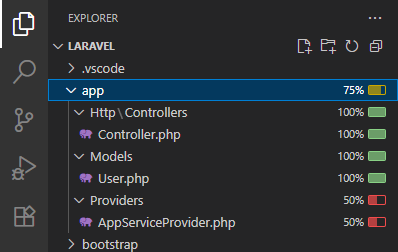

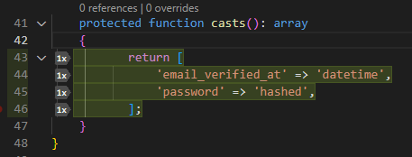

To disable the Code Coverage view, navigate to "TESTS RESULTS" panel and click "Close Test Coverage":

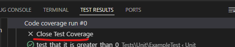

### Code Coverage on Remote Machine

Code Coverage works for workspaces on remote machines or docker containers.

Be noted, that running code coverage creates a temporary file `.vscode/.cobertura.tmp.xml` in your workspace. Since the process may run on a remote machine, you need to create a launch profile with `"pathMappings"` property. **Note**, this is not needed if you are connected directly to the remote machine via VSCode's _Remote Window_.

_Example `.vscode/launch.json` profile:

```json
      {
          "name": "My Remote Debug",
          "type": "php",
          "request": "launch",
          "pathMappings": {
              "/var/www/html": "${workspaceRoot}"
          },
      }
```

Right click on tests, and choose "Execute Using Profile ...":

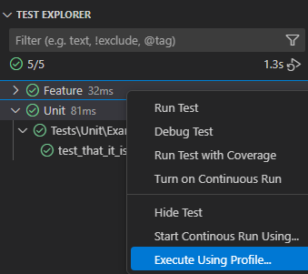

Then pick "Coverage (using My Remote Debug)":

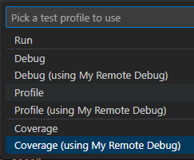

## Test Results

Test results are displayed:

- the Test Explorer view shows small icons next to each test and the test run duration. The icons meaning is:
  *  - The test was executed without errors.
  *  - The test was executed with errors; the error message is in the output tab.
  *  - The test was executed and skipped (see [incomplete-and-skipped-tests](https://phpunit.de/manual/6.5/en/incomplete-and-skipped-tests.html)).
  *  - Test is currently running (this is shown usually during debugging).
- the icon next to each test right in the code shows icon with the last test result as well.
- failures are displayed inline, right on the failed assertion:
  

The actual result of the PHPUnit execution is displayed in the **PHP (PHPUnit)** output tab, while each test has its own output available by clicking on the test in the Test Explorer View.


