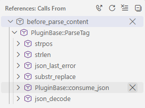

/*
Title: Call Hierarchy
Description: Navigating through Call Hierarchy
*/

# Call Hierarchy

> Available since `1.74`

The language server provides call hierarchy functionality across your code base.

Navigate to a function call or a function declarations, and from the context menu select _Show Call Hierarchy_.

> Limitation 1: the feature may be limited within the `vendor` folder.
