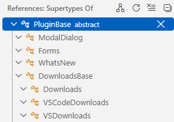

/*
Title: Type Hierarchy
Description: Navigating through Type Hierarchy
*/

# Type Hierarchy

The language server provides type hierarchy functionality across your codebase. It helps you explore inheritance and implementation relationships between classes, interfaces, and traits.

Navigate to a class, interface declaration, or even an expression, and select _Show Type Hierarchy_ from the context menu.

