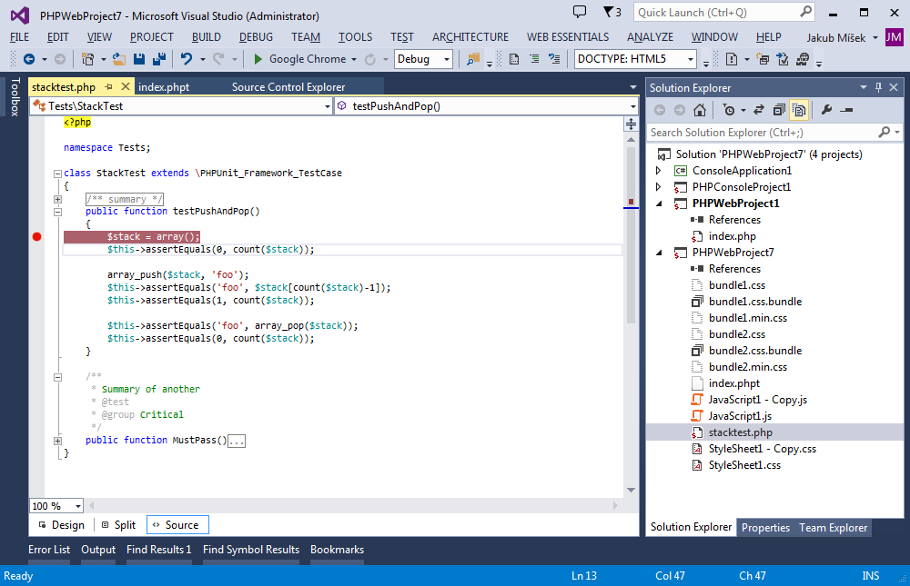
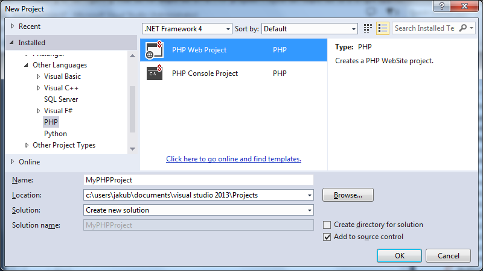
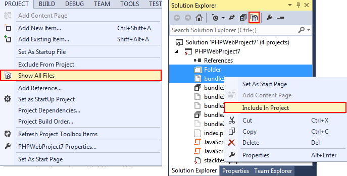
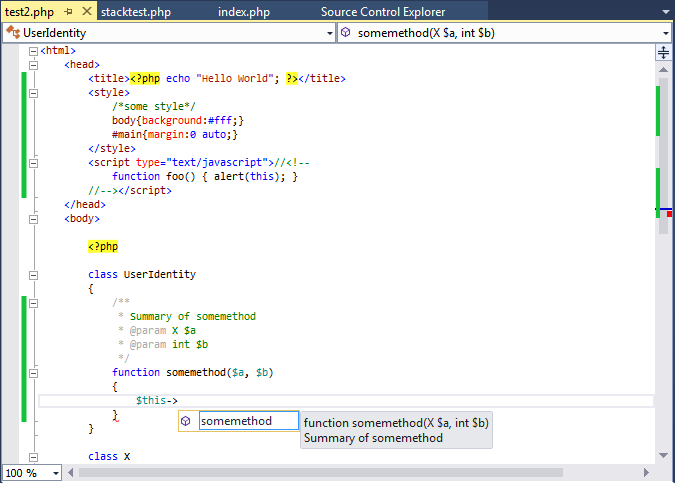
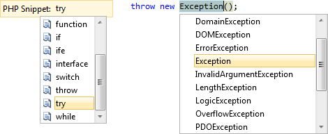

/*
Title: 入門
Description: PHP Tools documentation home page.
*/

# PHPツールの入門 

Visual Studio用PHPツールへようこそ。以下のガイドは基本的なことをお手伝いしますので、Microsoft Visual StudioでPHPの作業をすばやく始めることができます。

> **注:** Visual Studio用PHPツールは、Visual Studioの拡張機能です。Visual Studio Express のライセンスは拡張性を許さないことに注意してください。したがって、PHP ツールはVS Expressエディションをサポートしていません。

  
<a href="http://www.youtube.com/watch?v=UHlk9IFsaZU" class="popup-youtube" id="PHPToolsOverview" title="PHP Tools for Visual Studio Overview">

</a>

## IDEについて調べる

Visual Studioのメインウィンドウは、いくつかの領域に分かれています‐メニューバー、ステータスバー、エディタ領域、ソリューションエクスプローラを含むサイドパネル、およびさまざまなツールバーがあります。すべてのポジションを変更することができます。次の図は、デフォルトレイアウトを示しています。

Visual Studioを起動すると、スタートページがユーザーを歓迎します。これにより、最近のプロジェクトを開いたり、新しいプロジェクトをすばやく作成したりできます。

プロジェクトが始まると、ソリューションエクスプローラでプロジェクトの一部であるファイルを見ることができます。ソリューションエクスプローラはファイル、ファイルのプロパティ、プロジェクトプロパティを管理、検索、および開くことを可能にします。

エディタ領域には開いているファイルがあります。コンテンツの表示と変更、高度なIntelliSense機能、ナビゲーション機能、構文強調表示、ライブエラー検出などを利用することを機能にします。

## 最初のPHPプロジェクト

Visual Studioのほとんどの機能は、プロジェクトのコンテキスト内で機能します。デバッグ、IntelliSense、テスト、Webサーバーの設定は、PHPプロジェクトによって異なります。このプロジェクトは、単一のアプリケーションまたはライブラリに対応しています。ソースコントロールにバインドしたり、変更したファイルをリモートサーバーに公開するように構成することができます。

Visual Studioのプロジェクトは、ファイルのローカルコピーで動作します。サーバーにプッシュするために、自動パブリッシュを構成するか、自分でファイルを展開する必要があります。

Visual Studioで新しいプロジェクトを作成する方法はいくつかあります：

- 新しいPHPプロジェクトを最初から作成する。
- 既存のファイルからPHPプロジェクトを作成する。
- 既存のファイルをプロジェクトにインポートする。

### 最初から新しいPHPプロジェクト

新しいPHPプロジェクトは、PHPツールを使い始める最も簡単な方法です。'メニュー| ファイル| 新しい| プロジェクト 'を開き、' PHP 'グループを探します。必要なプロジェクトテンプレートを見つけて確認します。

追加のファイルとディレクトリは、以下のようにさまざまな方法で追加できます：

- メニューまたはソリューションエクスプローラで| プロジェクト| 新しい項目を追加セクションの中には
- Windowsエクスプローラからソリューションエクスプローラにドラッグアンドドロップする
- ソリューションエクスプローラで[すべてのファイルを表示]を有効にすることはプロジェクトディレクトリ内に物理的に存在するすべてのファイルがプロジェクトに表示されます

### 既存のフォルダ内の新しいプロジェクト

すでにローカルフォルダにファイルがある場合は、すべての既存のファイルでそのフォルダにPHPプロジェクトを作成することができます。メニュー| ファイル| 新しい| 既存のコードからのプロジェクト...に移動して、（この機能の可用性はVisual Studio版によって異なります）、ウィザードの手順を実行します。

### ローカルファイルをプロジェクトにインポートする

すでにプロジェクトがある場合は、既存のファイルを追加できます。より多くの情報については、最初から新しいPHPプロジェクトを参照してください。

## PHPファイルの編集

PHPツールは、Visual StudioにPHPファイルのスマートエディタを提供します。

これにより、ナビゲーションバー、アウトライン、構文ハイライトを利用して、コードの概要を確認することができます。PHP、HTML、JavaScript、またはCSSがミックスされていても、現行のコード・コンテキスト、ツールチップ・アシスタンスを考慮したスマートな自動補完機能Ctrl+Spaceにより、ヘルプ統合F1、定義に移動するF12とライブ・エラーの下線が表示され、エラーのないコードを作成することに役に立ちます。

ビルトインされたコードスニペットは、入力ミスを避けてコードを速く書くのに役立ちます。新しい機能体のようなコードスニペットCtrl+K,Xをループ、try / catch構造体などに挿入して開発をスピードアップすることができます。新しく挿入されたスニペットは自動的にフォーマットされ、カーソル位置は新しいコードの中に直接移動され、コードを即座に入力することができます。さらに、コードの選択された領域は、コピーペーストおよび他のリファクタリングの必要性を避けるためにスニペットCtrl+K,S囲むことができる。

## PHPプロジェクトの実行とデバッグ

PHPプロジェクトが存在すると、アプリケーションを実行してデバッグすることができます。デバッグを使用すると、アプリケーションを実行してブレークポイントで停止することF9、次の行にステップインすることF10、関数呼び出しの中F11、関数呼び出しの以外Shift+F11、変数を検査して変更することを可能にします。例としてローカル変数、スーパーグローバル変数、および現在のコールスタックがあります。

プロジェクトを実行してデバッグするには、プロジェクトが正しく構成されていることを確認して（下記参照）、F5キーを押します（またはメニュー|デバッグ|デバッグ開始を選択する）。Ctrl+F5を押すと、デバッグせずにプロジェクトを実行することもできます。

### PHPの設定

アプリケーションをローカルで実行するには、適切に設定されたPHPが必要です。デバッグのサポートを有効にするには、PHP拡張Xdebugもインストールして設定する必要があります。

PHPツールは、2つの方法でセットアップで役に立ちます。

最初のアプリケーション <kbd>F5</kbd> を起動し、有効なPHPインストールがない場合は、Microsoft Web Platform Installerからワンクリックで事前設定済みのXdebugを使用してPHPの推奨バージョンをダウンロードして設定できます。これは、ほとんどのユーザーにとって最も推奨されるオプションです。

カスタム要件を持つユーザや既存のPHPインストールを使用する必要があるユーザのために、PHPツールは設定を確認し、最終的に推奨される修正を提案することによって役立ちます。

プロジェクトの起動時に設定に問題がある場合、問題のダイアログが自動的に表示されます。`メニュー | ツール | オプション`, の `PHPのツール | 通訳`, のセクションに、**勧告を表示**. をクリックすることで、手動で起動できます。

`メニュー | ツール | オプション` の `PHPのツール | 通訳` のセクションにPHPのインストールとその設定のリストがあります。PHPのバージョン、Xdebugが検出されたかどうか、設定上の問題があるかどうかを確認できます。問題が発生した場合は、**勧告を表示** 警告をクリックし、推奨および推奨設定を自動的に適用することができます。

### リモートデバッグとカスタムWebサーバー

アプリケーションをリモートサーバー上で、または一覧にないWebサーバーを使用してローカルで実行するには、プロジェクトのプロパティに移動します。**カスタムWebサーバー** を選択し、そのURLを入力します。

この場合、PHPとXdebugの設定は、それらが正しくインストールされているか、正しく設定されているかはチェックされません。以下の条件を確認する必要があります：

- プロジェクトファイルは、デバッグする前にリモートサーバーに公開されるか、Webサーバーがローカルプロジェクトフォルダにマップされます。
- PHPとXdebugは、カスタムWebサーバー上で構成されています。
- Xdebugの設定はリモートデバッグを可能にします。
- カスタムサーバーは実行中で、指定したURLからアクセスできます。

## アプリケーションをテストする

PHPプロジェクトは、Visual Studioのテストエクスプローラに統合されています。テストケースを管理するために、`メニュー | テスト | Windows | テストエクスプローラ` 移動します。プロジェクトファイルがスキャンされ、PHPユニットテストケースが **テストエクスプローラ**. ウィンドウに自動的に表示されます。 

ウィンドウ内では、組み込みのPHP Unitフレームワークを使用して、テストケースを起動またはデバッグすることができます。**注**: テストエクスプローラ機能の使用可能性は、Visual Studioのエディションによって異なります。

## カスタマイズ

Visual Studio環境は完全にカスタマイズ可能です。カスタマイズしたがる最も一般的なタスクを以下に示します。

### PHPエディタで開くファイル拡張子

デフォルトの.phpファイル拡張子に加えて、他のファイル拡張子をPHPエディタ機能で編集するように設定することができます。これは、.php5、.inc、または.moduleなどのPHPスクリプトファイル用の非標準ファイル拡張子を使用するプロジェクトで作業する場合に便利です。`メニュー | ツール | オプション` にある `テキストエディタ | ファイル拡張子` のセクションに移動して、必要な追加のファイル拡張子をPHPエディタにマップします。

### フォントと色

PHPエディタは現在のユーザーの配色を従います。エディタまたはVisual Studio環境内の任意の色を設定できます。`メニュー | ツール | オプション` に移動して、`環境 | フォントと色`, セクションには、表示されている表示項目を変更します。PHP固有の色は、PHPの接頭辞が付きます。他の色はVisual Studioの組み込みの色と共有されます - 識別子、キーワード、コメント、文字列、番号、テキスト。

### キーボードマッピング

PHPツールは、Visual Studioキーボードスキームを従います。プロジェクトとエディタを操作するためのショートカットは、`メニュー | ツール | オプション` の `環境 | キーボード` セクションには管理されます。

### PHPエディタのオプション

PHPエディタのオプションには、コードの書式設定の調整、タブサイズの変更、IntelliSenseの微調整、さまざまなコードブロックのアウトラインの無効化などが含まれます。`メニュー | ツール | オプション` に移動して、`テキストエディタ | PHP` セクションを開いて、追加の設定を行います。

## 以上です。

クイックスタートガイドをお読みいただきありがとうございます。Visual StudioとPHPツールで多くの他のことができます。その他のヒントや質問については、残りのドキュメントと製品の機能ページを参照してください。