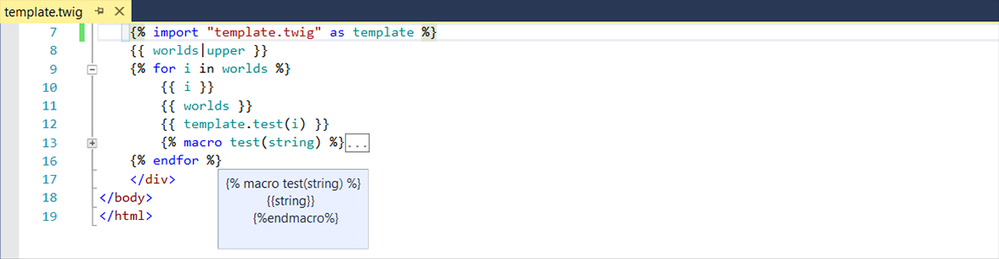

/*
Title: Twig
Description: Twig template engine support.
*/

# Twig Support

PHP Tools natively support the Twig template engine since version `1.25` in Visual studio 2015 and newer.
PHP Tools seamlessly integrate Twig support into the Visual Studio using the same shortcuts, commands and menus as the other languages.
The Twig support is built into the system and its features do not require the Twig engine to be installed in the project, but some features provide additional information when it is present (detailed information is provided for each feature).
Twig can be installed either via a composer package (directly available in the PHP Tools) or its source code can be directly included into the project.

  
<a href="http://www.youtube.com/watch?v=P10QBhoFgEs" class="popup-youtube" id="TwigVS" title="Twig Editor in Visual Studio">

</a>

## Syntax Highlighting

PHP Tools provides syntax highlighting for Twig templates.
The colors follow the Visual studio color scheme and support Visual Studio themes.
Syntax highlighting does not require Twig to be installed. 

<i>Twig syntax highlighted for a short template.</i>

## Syntax Validation

PHP Tools provides complete syntax validation for Twig templates.
The syntax analysis reports all the syntax errors, as well as some of the errors reported by Twig runtime during rendering.
This feature helps to create valid Twig templates and avoids common errors.

<i>Syntax error in a Twig template (filter used without separator <code>|</code>).</i>

## Tooltips

PHP Tools provides tooltips for all known variables and filters (both user defined and intrinsic).
The tooltips for filters are based PHPDoc documentation and their structure follows the Twig notation (`$value|default_filter:$default=""`).
Basic tooltips are provided for all known constructs and additional information is provided for filters declared with PHPDoc documentation.
PHP Tools provide tooltips for the following constructs: 
- Built-in filters (requires Twig installation).
- User defined filters (declaration must be part of the project). 
- Variables defined in PHP (both global and local).
- Variables used in Twig template (variables used in the currently edited template).

<i>Tooltip for the built-in filter <code>upper</code>.</i>

## Completion

PHP Tools provides completion assistance containing all the known filters, variables and keywords.
The completion list is displayed either when user starts typing a new word or when the completion is directly triggered by the `Complete Word` command <kbd>Ctrl+Space</kbd>.
The completion supports the following features:
- Built-in filters (requires Twig installation).
- User defined filters. 
- Variables defined in PHP (both global and local).
- Variables previously used in the Twig template (variables used in the currently edited template).
- Twig keywords.

<i>Completion list for the word <code>upp</code> with the built-in filter <code>upper</code> selected as best match.</i>

## Navigation

PHP Tools supports the `Go To Definition` command (<kbd>F12</kbd>) for all the variables and filters, either intrinsic or user defined.
The command opens the file containing the definition of the currently selected variable or filter and places the caret its beginning.
Twig navigation is integrated with PHP, custom filters and variables in PHP.
The navigation supports the following features:
- Built-in filters (requires Twig installation).
- User defined filters. 
- Variables defined in PHP (both global and local).

## Help

PHP Tools supports the `Help` command (<kbd>F1</kbd>) for all the keywords.
The command opens the web documentation for the selected construct.
The help supports the following features:
- Twig keywords

## Reference Highlighting

PHP Tools highlights all the occurrences of the selected variable of filter in the actual template.
PHP Tools use the same color scheme as Visual Studio, which is compatible with the VS themes.
The reference highlighting supports the following features:
- Built-in and user defined filters. 
- Variables defined in PHP (both global and local).
- Variables defined in the Twig template (variables used in the currently edited template).

<i>PHP Tools highlighting all the occurrences of the <code>worlds</code> variable.</i>

## Outlining

PHP Tools provides outlining for Twig block constructs. 
This feature is built into PHP Tools, but it requires a syntactically valid Twig template.
Some constructs are outlined even in an invalid template, but most will be ignored. 
PHP Tools provides tooltips for all collapsed constructs.
PHP Tools provides outlining for the following constructs:
- Macro, block, embed (outlining is available even for an invalid template)
- <code>If, for, while</code> and other block constructs (outlining is only available in a valid template)

<i>Twig outlining used to collapse the <code>test</code> macro, a tooltip shows the body of the macro.</i>

## Twig SplitView

PHP Tools offers a split view mode for Twig, where the left panel displays Twig code and the right panel contains the actual PHP code that will be generated from the template by Twig framework.
The left panel (Twig) is editable and any changes are interactively propagated to the right panel, while the PHP panel is read-only with syntax highlighting, tooltips and navigation.
Both panels highlight the language construct created from the construct under the caret. 
They are highlighted at the same time and it allows programmers to check what PHP code is generated from the selected Twig code, as well as what Twig code produced the selected PHP code.
The panels are synchronized and navigating in one panel automatically scrolls the other one.
This feature allows programmers to check the final PHP code during template design and it provides information for optimization.
The SplitView provides the following tools:
- PHP code generated from the current Twig template
- Synchronized navigation in both panels
- Highlighting of linked constructs in both panels
- Full syntax highlighting, navigation and tooltips in both panels

<i>Twig SplitView highlighting and navigation.</i>

> SplitView can be hidden using the Twig editor options in `Tools->Options->Text Editor->Twig`

## Construct Completion

PHP Tools provides a simplified version of the `Insert Snippet` (<kbd>Tab</kbd>) command for Twig blocks, like `if` or `for`.
The command is activated by pressing <kbd>Tab</kbd> when the caret is placed at the end of certain keywords.
When used for a pair keyword, PHP Tools adds the end tag (for example ``) and standard parameters supported by the construct, like initial values or limits.
PHP Tools supports the following keyword:
- verbatim
- import
- include
- set
- with
- filter
- autoescape
- spaceless
- embed
- if
- else
- for

<i>Construct completion used on a Twig <code>for</code> loop.</i>

## User Extension Support

PHP Tools supports filters natively provided by the Twig engine and all the allowed user extensions and definitions.
User extensions are supported by all the other features provided by PHP Tools, like tooltips, completion and navigation.
PHP Tools support the following extensions:
- User defined filters (PHP functions added to Twig environment using `$twig->addFilter($filter);`). 
- Global variables defined in PHP (defined using `$twig->addGlobal('name', $value);`).
- Template-local variables defined in PHP (defined when rendering the template `$twig->render('template.twig', array('value'));`).

<i>Completion suggestion for a user defined Twig filter.</i>

## Custom Extensions

The PHP Tools Twig editor is automatically used for templates with the `.twig` extension. It has to be manually opened for the templates with other extensions. 
This is done by <kbd>right clicking</kbd> the template file in the Solution Explorer and selecting the `Open With...` command. 
The command opens the `Open With` dialog, where it is necessary to locate the `Twig Template Editor`, select it and click `OK`. 

<i>PHP Tools Twig editor used to open a template with a custom extension.</i>

## Twig Package Installation

Twig can be installed either via a composer package or its source code can be directly included into the project.
PHP Tools provides an information bar whenever a Twig template is opened without the Twig template engine installation.
It allows users to seamlessly install the Twig composer package, simply by clicking on the `Install now link`.
The bar disappears once Twig is installed. The bar can be closed either once or forever by clicking the appropriate button.

<i>Twig information bar displayed when editing a Twig template without a Twig installation.</i>

## Options

PHP Tools provides global options, which modify how the editor works with Twig code.
The settings are global for the Visual Studio and can be specified in `Tools->Options->Text Editor->Twig`.
The settings include standard text editor options (intellisense and indentation) available for all editors and Twig specific options in the `Advanced` tab.
PHP Tools provides the following options for Twig:
- General options are fully supported, except the Parameter information which is not available in Twig
- Scroll Bars options are fully supported
- Tabs options are fully supported
- Advanced options contain the `Show SplitView` option that toggles the SplitView for all Twig templates

## Limitations

PHP Tools supports Twig integration with HTML, Cascading Style Sheets (CSS), JavaScript and TypeScript in Visual studio 2015 and newer.
